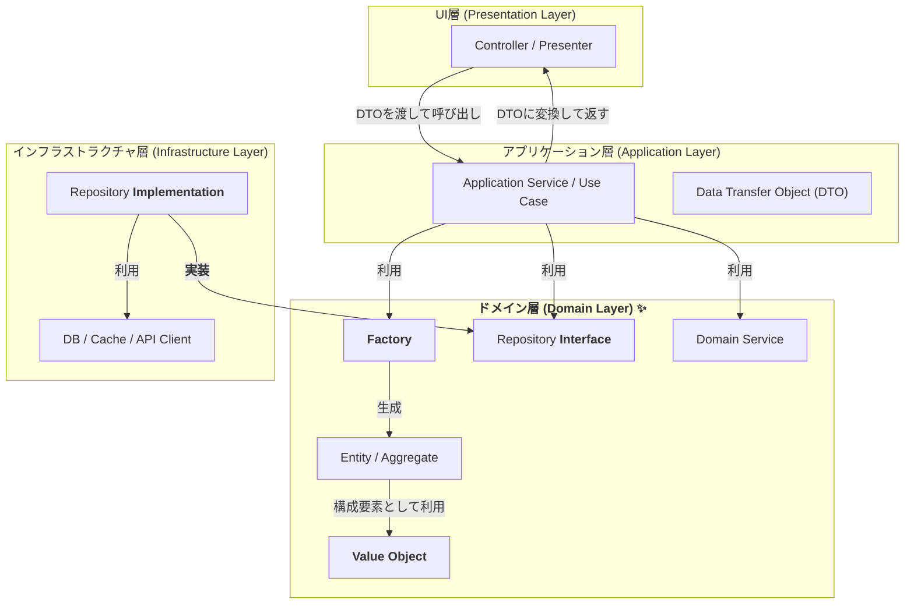
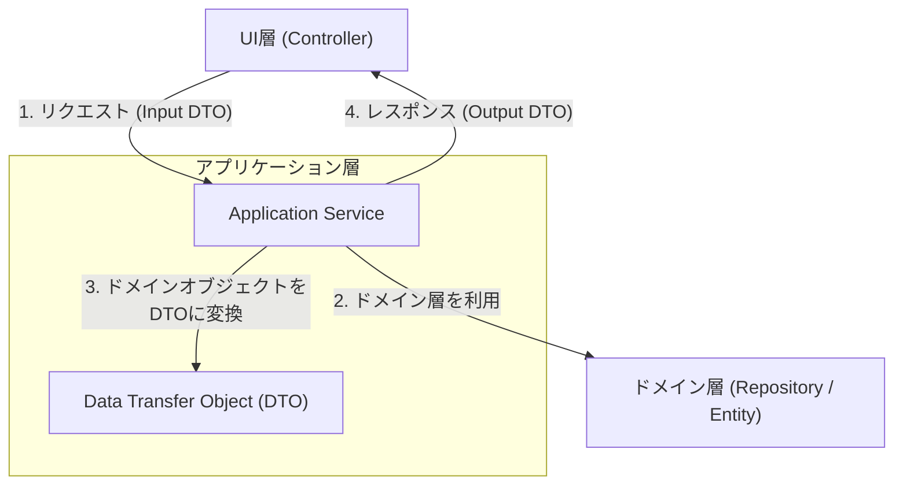

# プロジェクト開発スタイルガイド

> 🤖 **Gemini向けの重要な情報**  
> このスタイルガイドは、AIアシスタント（特にGoogle Gemini）がコード生成・提案を行う際の参照ドキュメントとして作成されています。
>
> **プロジェクトの技術スタックと設計原則：**
>
> - **依存性注入フレームワーク**: Uber Fx
> - **コンストラクタパターン**: 「インターフェースを受け入れ、具象（struct）を返す」
> - **命名規則**: コンストラクタ名に`Impl`サフィックス（例：`NewProductServiceImpl`）
> - **DIパターン**: `fx.Annotate`と`fx.As`で具象型をインターフェースに変換
>
> コード生成・提案時は、これらの原則を必ず遵守してください。

## 1. 基本方針

### 1.1. 目的と価値観

- **品質重視**: コードの品質、保守性、一貫性を向上させ、長期的な開発効率を追求する。
- **チーム成長**: 開発者の技術的成長を支援し、知識の共有を促進する
- **ユーザー価値**: 最終的にはユーザーに価値を提供することを最優先とする

### 1.2. コミュニケーション指針

- **言語**: レビュー、コメント、ドキュメントは日本語で統一
- **建設的姿勢**: 問題指摘時は必ず改善案とその理由を併記
- **学習支援**: 関連するベストプラクティスや学習リソースを積極的に共有
- **心理的安全性**: 質問や議論を歓迎し、失敗から学ぶ文化を醸成

## 2. コードレビューガイドライン

> 📋 **このセクションのサマリー**  
> 効果的なコードレビューの手法を定義。優先度付きの観点、構造化されたコメント手法、ポジティブフィードバックの重要性を説明します。

コードレビューは単なる品質チェックではなく、知識共有とチーム学習の貴重な機会です。レビュワーは教師として、レビュイーは学習者として、互いに成長できる場にします。効果的なレビューは、コードの品質向上だけでなく、チーム全体の技術力底上げにも寄与します。

### 2.1. レビューの優先順位

レビューでは無数の改善点が見つかりますが、すべてを同じ重要度で扱うと、本質的な問題が見落とされがちです。以下の優先順位に従って、重要な問題から順に取り組みます：

以下の観点を**優先度順**で評価し、レビューコメントを作成する。

| 優先度 | 観点 | チェック項目例 | 影響範囲 |
| :---: | :--- | :--- | :--- |
| **🔴 最高** | **Correctness (正確性)** | 仕様を満たしているか？バグやエッジケースは考慮されているか？ | ユーザー体験直結 |
| **🟠 高** | **Security (セキュリティ)** | SQLインジェクション等の脆弱性はないか？入力値のバリデーションは適切か？ | システム全体 |
| **🟡 中高** | **Performance (パフォーマンス)** | 非効率なアルゴリズムはないか？N+1問題やメモリリークはないか？ | システム性能 |
| **🔵 中** | **Maintainability (保守性)** | 責務は適切に分離されているか？将来の変更は容易か？複雑度は適切か？ | 開発効率 |
| **🟢 低** | **Readability (可読性)** | 命名は適切か？ロジックは追いやすいか？コメントは必要十分か？ | 開発者体験 |
| **⚪ 最低** | **Consistency (一貫性)** | プロジェクトのコーディング規約や設計パターンに準拠しているか？ | コード統一性 |

### 2.2. レビュー時の着眼点

#### 🎯 特に注目すべきポイント

- **エラーハンドリング**: 例外的なケースでの動作は安全か？
- **リソース管理**: DB接続、ファイルハンドル、goroutineの適切なクリーンアップ
- **並行処理**: データ競合やデッドロックの可能性はないか？
- **テスト容易性**: モックやスタブが使いやすい設計になっているか？

## 3. 効果的なレビューコメントの書き方

> 📋 **このセクションのサマリー**  
> 建設的で実用的なレビューコメントの作成方法。STARメソッドによる構造化、重要度の明示、学習リソースの提供を通じて、真に価値あるフィードバックを実現します。

レビューコメントは、相手に行動を促す重要なコミュニケーションツールです。単なる指摘ではなく、相手の理解を深め、具体的な改善行動につながるコメントを心がけます。効果的なコメントは、即座に問題を解決するだけでなく、将来的に同様の問題を避ける学習効果も生み出します。

### 3.1. 重要度の明示とアクションの明確化

コメントを受ける側が適切な優先順位で対応できるよう、重要度とアクションを明確に示します。これにより、限られた時間の中で最も効果的な改善が可能になります：

コメントには重要度と必要なアクションを明記し、開発者が優先順位を判断できるようにする。

| 重要度 | アクション | 対象例 | タイムライン |
| :---: | :--- | :--- | :--- |
| **🔴 CRITICAL** | **マージ前に必須修正** | バグ、セキュリティ脆弱性、データ破損リスク | 即座 |
| **🟠 HIGH** | **マージ前の修正を強く推奨** | パフォーマンス問題、保守性の問題 | 24時間以内 |
| **🟡 MEDIUM** | **次回イテレーションで修正** | リファクタリング、テスト追加 | 1週間以内 |
| **🟢 LOW** | **時間のあるときに修正** | 命名改善、コメント追加 | バックログ |
| **🔵 INFO** | **情報提供・質問** | ベストプラクティス紹介、代替手法の提案 | - |

### 3.2. 効果的なコメントの構造

コメントは以下の**STARメソッド**で構成する。

```

🎨 **[SEVERITY] 状況 (Situation)**
🔍 **原因 (Task/Problem)**
📝 **提案 (Action)**
🎆 **期待される結果 (Result)**

```

#### 悪い例：指摘のみ

```

この変数名は分かりにくい。

```

#### 良い例：STARメソッド適用

```

🎨 **[LOW] 変数名の可読性問題**
変数 `d` が何を表しているのかが一目でわかりません。

🔍 **原因**
短い略記名はコードの可読性を下げ、メンテナンスコストを増加させます。

📝 **提案**

```go
// Before
d := time.Since(startTime)

// After
elapsedTimeInSeconds := time.Since(startTime)
```

🎆 **期待される結果**
コードの意図が明確になり、新しいメンバーでも理解しやすくなります。

```

### 3.3. コード例とリソースの提供

#### コード例のベストプラクティス

1. **Before/After形式**: 現在のコードと改善後のコードを並べて表示
2. **実行可能なコード**: コピー＆ペーストですぐに試せるように
3. **コメント付き**: 重要な部分には説明コメントを追加

#### 学習リソースの提供

コメントには関連する学習リソースを積極的に含める。

- **公式ドキュメント**: Goの公式ドキュメントやEffective Goへのリンク
- **ベストプラクティス記事**: 信頼できる技術ブログや書籍への参照
- **内部リソース**: プロジェクト内の関連コードやドキュメントへのリンク

### 3.4. ポジティブフィードバックの実践

#### 認めるべき優れた点

- **✨ 優雅な設計**: シンプルで理解しやすいアーキテクチャ
- **🎨 美しいコード**: 読みやすく、一貫性のあるコード
- **🔧 巧妙な解法**: パフォーマンスやメモリ効率を考慮した実装
- **🛡️ 強固なエラーハンドリング**: 例外的ケースを適切に処理
- **🧪 網羅的なテスト**: エッジケースを含む十分なテストカバレッジ

#### ポジティブコメントの例

```

🎆 **素晴らしい実装です！**
このコンテキストパッケージの設計は、タイムアウトとキャンセルを適切に処理しており、Goのベストプラクティスに完全に準拠しています。

特に、deferを使ったリソースのクリーンアップが美しく、メモリリークやゴルーチンリークの心配がありません。

📚 **参考**: [Effective Go - コンテキスト](https://golang.org/doc/effective_go#concurrency)

```

## 4. プロジェクト固有の技術ガイドライン

> 📋 **このセクションのサマリー**  
> gRPC/Protocol Buffers、Go言語、マイクロサービスアーキテクチャに特化した実践的ガイドライン。具体的なコード例と実装パターンを通じて、プロジェクトの技術スタックを最大限に活用する方法を説明します。

本プロジェクトでは、モダンなマイクロサービスアーキテクチャを採用しています。gRPCによる高性能な内部通信、型安全なProtocol Buffers、Go言語の並行性機能を組み合わせて、スケーラブルで保守性の高いシステムを構築します。

以下のガイドラインは、これらの技術を効果的に活用し、チーム全体で一貫した実装を行うための指針です。単なるルールではなく、なぜそのパターンが推奨されるのかの理由と、具体的な実装方法を含めて説明します。

### 4.1. 🚀 gRPC & Protocol Buffers (buf + connect-go)

gRPCとProtocol Buffersは、マイクロサービス間の効率的で型安全な通信を実現します。しかし、その強力さを最大限に活用するには、適切な設計パターンと運用ルールが不可欠です。

**なぜこれらの技術を選択したのか：**
- **パフォーマンス**: バイナリプロトコルによる高速通信
- **型安全性**: コンパイル時の型チェックによるバグの早期発見
- **言語間互換性**: 複数の言語で同じスキーマを共有可能
- **後方互換性**: 適切に設計すれば、APIの進化が容易

#### 4.1.1. アーキテクチャ設計原則

適切なパッケージングと命名は、APIの可読性と保守性を大きく左右します。サービスが成長しても継続的に管理できるよう、一貫した戦略を立てます。

##### 📦 パッケージング戦略

バージョニングを含む明確なパッケージ名は、APIの進化と互換性の管理を容易にします：

```protobuf
// ✅ 推奨: 明確な階層構造
package myservice.command.v1;
package myservice.query.v1;
package myservice.common.v1;

// ❌ 非推奨: バージョンなし、不明確な構造
package myservice;
package commands;
```

**このパターンが重要な理由：**

推奨パターンでは、サービス名、機能カテゴリ、バージョンが明確に分かれます。これにより、開発者はどのAPIがどのサービスのどのバージョンに属するかを一目で理解でき、コードの可読性と保守性が大幅に向上します。また、バージョン情報が含まれることで、以降の破壊的変更の管理が容易になります。

##### 🎯 命名規約の統一

| 要素 | 規約 | 良い例 | 悪い例 |
| :--- | :--- | :--- | :--- |
| **RPCメソッド** | `VerbNoun` | `CreateProduct`, `ListOrders` | `ProductCreate`, `GetAllOrders` |
| **メッセージ** | `MethodNameRequest/Response` | `CreateProductRequest` | `ProductCreateReq`, `CreateReq` |
| **サービス** | `NounService` | `ProductService`, `OrderService` | `Products`, `OrderManager` |
| **フィールド** | `snake_case` | `user_id`, `created_at` | `userId`, `CreatedAt` |

#### 4.1.2. 🎨 メッセージ設計パターン

ユーザーフレンドリーでスケーラブルなAPIを設計するための実証済みパターンです。これらのパターンは、Google API Design Guideや一般的なベストプラクティスに基づいています。

##### 📄 ページネーション (必須実装)

大量のデータを扱うAPIでは、ページネーションは必須です。トークンベースのページネーションを採用することで、データの一貫性を保ち、パフォーマンスを最適化します：

```protobuf
// ✅ 推奨: トークンベースページネーション
message ListProductsRequest {
  int32 page_size = 1;   // 最大100、デフォルト20
  string page_token = 2; // Base64エンコードされたカーソル
  
  // フィルター条件（オプショナル）
  string category = 3;
  google.protobuf.Timestamp created_after = 4;
}

message ListProductsResponse {
  repeated Product products = 1;
  string next_page_token = 2;  // 次ページなしの場合は空文字列
  int32 total_count = 3;       // 可能な場合のみ提供
}
```

**ページネーションの本質と利点：**

このパターンは、大量のデータを扱うAPIでの標準的なアプローチです。`page_token`は不透明な文字列であり、サーバー側でデータの位置や状態を管理します。これにより、ページング中にデータが変更されても一貫性を保つことができ、ユーザーは重複や欠損なしにすべてのデータを取得できます。また、フィルター条件を含めることで、クライアントは必要なデータのみを効率的に取得でき、ネットワーク帯域と処理時間を節約できます。

##### 🎯 部分更新パターン

```protobuf
import "google/protobuf/field_mask.proto";

// ✅ 推奨: FieldMaskを使用した部分更新
message UpdateProductRequest {
  Product product = 1;
  google.protobuf.FieldMask update_mask = 2;
  
  // バージョニング（楽観的ロック）
  string etag = 3;
}

// 使用例（クライアント側）
// update_mask: "name,price,description"
```

**FieldMaskの革新性と実用性：**

`FieldMask`は部分更新の標準的な手法で、REST APIのPATCHメソッドに相当します。クライアントは更新したいフィールドのみを指定でき、サーバー側ではそのフィールドのみを更新します。これにより、不意なデータの上書きを防げると同時に、ネットワーク帯域を節約できます。`etag`を組み合わせることで、楽観的ロッキングを実現し、同時更新によるデータの破損を防ぐことができます。

##### 🔄 冪等性とリトライ対応

```protobuf
import "buf/validate/validate.proto";

message CreateOrderRequest {
  Order order = 1;
  
  // 冪等性キー（UUID v4推奨）
  string idempotency_key = 2 [
    (buf.validate.field).string = {
      pattern: "^[0-9a-f]{8}-[0-9a-f]{4}-4[0-9a-f]{3}-[89ab][0-9a-f]{3}-[0-9a-f]{12}$"
      ignore_empty: true
    }
  ];
}
```

**冪等性キーの重要性と実装詳細：**

冪等性キーは、マイクロサービス環境での信頼性の高い通信のために不可欠です。ネットワーク障害やタイムアウトにより、クライアントが同じリクエストを繰り返し送信することがあります。冪等性キーを使用することで、サーバー側では同じキーでの重複リクエストを検知し、安全に無視または同じ結果を返すことができます。UUID v4の使用と正規表現による験証は、キーの一意性とフォーマットの正当性を保証します。

##### ✅ バリデーション戦略

protovalidateを使用したバリデーションは、型安全で宣言的な方法でメッセージの制約を定義できます。以下は基本的なバリデーションパターンです：

```protobuf
import "buf/validate/validate.proto";

message CreateUserRequest {
  // メールアドレスのバリデーション
  string email = 1 [(buf.validate.field).string.email = true];
  
  // 文字列の長さとパターンのバリデーション
  string name = 2 [(buf.validate.field).string = {
    min_len: 1
    max_len: 100
    pattern: "^[a-zA-Z0-9\\s\\-_]+$"
  }];
  
  // 数値の範囲バリデーション
  int32 age = 3 [(buf.validate.field).int32 = {
    gte: 0
    lte: 150
  }];
}
```

**protovalidateの利点：**

- **ランタイムバリデーション**: コード生成不要で、ランタイムにバリデーションを実行
- **Opaque API対応**: 新しいprotoc-gen-goのOpaque APIと完全互換
- **宣言的**: バリデーションロジックがprotoファイルで一元管理される
- **型安全**: コンパイル時に制約の妥当性がチェックされる

#### 4.1.3. 🔄 API進化戦略

APIの進化は、マイクロサービスアーキテクチャで最も重要な課題の一つです。不適切な変更は、システム全体の停止やデータの不整合を引き起こす可能性があります。

**API進化の金則：**

- **互換性第一**: 既存クライアントを壊さない
- **漸進的移行**: 段階的な変更でリスクを最小化
- **明確なコミュニケーション**: 変更の理由と影響を明確に伝える

##### 📋 変更管理ルール

以下のルールに従って、安全なAPIの進化を実現します：

| 変更タイプ | 許可 | 実装方法 | 注意点 |
| :--- | :---: | :--- | :--- |
| **フィールド追加** | ✅ | 新しいフィールド番号で追加 | 常にオプショナル |
| **オプショナルフィールド削除** | ⚠️ | `reserved` で予約 | フィールド番号は再利用禁止 |
| **フィールド名変更** | ❌ | 新規追加→古いものをreserved | 段階的な移行が必要 |
| **フィールド型変更** | ❌ | 新しいフィールドとして追加 | 互換性なし |
| **必須フィールド化** | ❌ | バリデーション層で対応 | protoではオプショナル維持 |

##### 🛡️ 破壊的変更の防止

```yaml
# .github/workflows/buf.yml
- name: Breaking Change Detection
  uses: bufbuild/buf-action@v1
  with:
    breaking_against: 'https://github.com/${{ github.repository }}.git#branch=main,subdir=api'
    lint: true
    breaking: true
```

##### 📝 フィールド廃止のベストプラクティス

```protobuf
message Product {
  string id = 1;
  string name = 2;
  
  // 廃止されたフィールドの予約
  reserved 3;           // old_price フィールド（削除済み）
  reserved "old_price"; // フィールド名も予約
  
  // 新しい価格フィールド
  Price price = 4;
}
```

### 4.2. 🛡️ エラーハンドリング戦略

マイクロサービスアーキテクチャでは、エラーは避けられない現実です。重要なのは、エラーが発生した際にシステム全体の信頼性を保ち、適切な復旧措置を取れることです。

**効果的なエラーハンドリングの原則：**

- **透明性**: エラーの原因と発生箇所を明確に特定できる
- **回復可能性**: 一時的なエラーは自動的に回復を試行する
- **ユーザビリティ**: エンドユーザーに分かりやすいエラーメッセージを提供
- **運用性**: 運用チームが迅速に問題を特定・解決できる情報を提供

#### 4.2.1. エラーラッピングのベストプラクティス

Goのエラーハンドリングは、適切にラッピングすることでスタックトレースのような情報を保持できます。これにより、デバッグ時に問題の根本原因を特定しやすくなります：

```go
// ✅ 推奨: コンテキスト付きエラーラッピング
func (s *ProductService) GetProduct(ctx context.Context, id string) (*Product, error) {
    product, err := s.repo.FindByID(ctx, id)
    if err != nil {
        return nil, fmt.Errorf("failed to get product %s: %w", id, err)
    }
    return product, nil
}

// ❌ 非推奨: コンテキスト情報の欠如
func (s *ProductService) GetProduct(ctx context.Context, id string) (*Product, error) {
    product, err := s.repo.FindByID(ctx, id)
    if err != nil {
        return nil, err // コンテキスト情報が失われる
    }
    return product, nil
}
```

**エラーラッピングの哲学と実践的利益：**

推奨パターンでは、`fmt.Errorf`の`%w`ベーブを使って元のエラーをラッピングし、同時にコンテキスト情報（この例では商品ID）を追加しています。これにより、エラーが発生した際に、開発者は具体的にどの商品の取得に失敗したのかを理解でき、デバッグ作業が大幅に効率化されます。また、元のエラーが保持されるため、エラーチェーンを追跡して根本原因を特定できます。

#### 4.2.2. エラータイプ判定とハンドリング

Go 1.13から導入された`errors.As`は、エラーチェーンを遡って特定のエラー型を判定するための標準的な方法です。これにより、エラーの型に応じた分岐処理を安全かつ簡潔に記述できます。

```go
// カスタムエラー型の定義
type DomainError struct {
    Code    string
    Message string
    Cause   error
}

func (e *DomainError) Error() string {
    if e.Cause != nil {
        return fmt.Sprintf("%s: %s: %v", e.Code, e.Message, e.Cause)
    }
    return fmt.Sprintf("%s: %s", e.Code, e.Message)
}

func (e *DomainError) Unwrap() error {
  return e.Cause
}

// エラータイプ別のハンドリング (プレゼンテーション層)
func handleError(err error) *connect.Error {
    var domainErr *DomainError
    var mysqlErr *mysql.MySQLError
    var netErr *net.OpError

    // errors.As を使ってエラーチェーンを遡り、型をチェックする
    if errors.As(err, &domainErr) {
        // ドメインエラーの場合
        switch domainErr.Code {
        case "NOT_FOUND":
            return connect.NewError(connect.CodeNotFound, domainErr)
        case "INVALID_ARGUMENT":
            return connect.NewError(connect.CodeInvalidArgument, domainErr)
        default:
            return connect.NewError(connect.CodeInternal, domainErr)
        }
    } else if errors.As(err, &mysqlErr) {
        // MySQL固有のエラーの場合
        switch mysqlErr.Number {
        case 1062: // Duplicate entry
            return connect.NewError(connect.CodeAlreadyExists, fmt.Errorf("duplicate entry: %w", err))
        default:
            return connect.NewError(connect.CodeInternal, fmt.Errorf("database error: %w", err))
        }
    } else if errors.As(err, &netErr) {
        // ネットワークエラーの場合
        return connect.NewError(connect.CodeUnavailable, fmt.Errorf("network error: %w", err))
    }
    
    // システムエラーの場合
    return connect.NewError(connect.CodeInternal, fmt.Errorf("internal server error"))
}
```

**カスタムエラー型の設計意図と効果：**

この`DomainError`構造体は、ビジネスロジック層で発生するエラーを構造化し、標準化するためのパターンです。`Code`フィールドはエラーの種類を機械的に判定できるようにし、`Message`フィールドは人間が読める説明を提供します。`Cause`フィールドにより元のエラーを保持し、エラーチェーンを構築できます。`handleError`関数では、ドメインエラーを適切なgRPCステータスコードにマッピングし、クライアントが適切な対応を取れるようにしています。

#### 4.2.3. ログ出力とメトリクス

```go
// エラーレベル別のログ出力
func (s *ProductService) CreateProduct(ctx context.Context, req *CreateProductRequest) error {
    if err := s.validator.Validate(req); err != nil {
        // クライアントエラーはINFOレベル
        slog.InfoContext(ctx, "validation failed", 
            "error", err, 
            "request", req)
        return fmt.Errorf("validation failed: %w", err)
    }
    
    if err := s.repo.Create(ctx, req.Product); err != nil {
        // システムエラーはERRORレベル
        slog.ErrorContext(ctx, "failed to create product", 
            "error", err,
            "product_id", req.Product.Id)
        return fmt.Errorf("failed to create product: %w", err)
    }
    
    return nil
}
```

### 4.3. 🔗 依存関係管理

適切な依存関係管理は、テスタブルで保守性の高いコードの基盤です。依存性注入（DI）パターンを活用することで、各コンポーネントの責務を明確にし、結合度を下げます。

**依存関係管理の利点：**

- **テスタビリティ**: モックを使った単体テストが容易
- **柔軟性**: 実装を簡単に切り替え可能
- **保守性**: 変更の影響範囲を限定
- **再利用性**: コンポーネントの独立性が高まる

#### 4.3.1. 依存性注入 (DI) パターンと「インターフェースを受け入れ、具象を返す」設計思想

Goでは明示的な依存性注入フレームワークは必須ではありませんが、fxなどを使用することで、コンパイル時に依存関係を解決し、ランタイムエラーを防げます。

##### 🎯 「インターフェースを受け入れ、具象（struct）を返す」原則

Goの重要な設計思想の一つは、**コンストラクタはインターフェースを引数として受け取り、具象型（struct）を返す**ことです。この原則により、以下の利点が得られます：

**設計思想の利点：**

- **柔軟性**: 呼び出し側が必要に応じてインターフェースとして扱える
- **明示性**: 返り値の型から具象型が明確にわかる
- **テスタビリティ**: 依存関係をモックで置き換えやすい
- **型安全性**: コンパイル時に型の整合性が保証される

```go
// インターフェースの定義（ドメイン層）
type ProductRepository interface {
    FindByID(ctx context.Context, id string) (*Product, error)
    Create(ctx context.Context, product *Product) error
    Update(ctx context.Context, product *Product) error
    Delete(ctx context.Context, id string) error
}

type ProductService interface {
    GetProduct(ctx context.Context, id string) (*Product, error)
    CreateProduct(ctx context.Context, product *Product) error
}

// サービスの実装（アプリケーション層）
type ProductServiceImpl struct {
    repo      ProductRepository // インターフェースに依存
    validator Validator
    logger    *slog.Logger
}

// ✅ 推奨: インターフェースを受け取り、具象型を返す
// コンストラクタ名に "Impl" を含めることで、具象型を返すことを明示
func NewProductServiceImpl(
    repo ProductRepository,      // インターフェースを受け入れる
    validator Validator,          // インターフェースを受け入れる
    logger *slog.Logger,
) *ProductServiceImpl {           // 具象型を返す
    return &ProductServiceImpl{
        repo:      repo,
        validator: validator,
        logger:    logger,
    }
}

// 使用例：呼び出し側で必要に応じてインターフェースとして扱う
func main() {
    // 具象型として受け取る
    svc := NewProductServiceImpl(repo, validator, logger)
    
    // 必要に応じてインターフェースとして使用
    var service ProductService = svc
    
    // または直接インターフェース変数に代入
    var service2 ProductService = NewProductServiceImpl(repo, validator, logger)
}

// ❌ 非推奨: インターフェースを返すパターン
func NewProductService(
    repo ProductRepository,
    validator Validator,
    logger *slog.Logger,
) ProductService {  // インターフェースを返す（推奨されない）
    return &ProductServiceImpl{
        repo:      repo,
        validator: validator,
        logger:    logger,
    }
}
```

**このパターンが推奨される理由：**

1. **呼び出し側の自由度**: 具象型を受け取ることで、呼び出し側がインターフェースとして扱うか、具象型として扱うかを選択できます。インターフェースを返す場合、この選択肢が失われます。

2. **実装の明確性**: コンストラクタ名に`Impl`を含めることで、具象型を返すことが一目でわかり、コードの意図が明確になります。

3. **DIフレームワークとの親和性**: Uber FxなどのDIフレームワークでは、具象型を返すコンストラクタを`fx.Annotate`と`fx.As`で簡単にインターフェースに変換できます。

4. **デバッグの容易性**: 具象型を返すことで、デバッガーで実際の型情報を確認しやすくなります。

##### 📦 リポジトリ実装の例

```go
// リポジトリの実装（インフラストラクチャ層）
type ProductRepositoryImpl struct {
    db *sql.DB
}

// ✅ 推奨: インターフェースを受け取り、具象型を返す
func NewProductRepositoryImpl(db *sql.DB) *ProductRepositoryImpl {
    return &ProductRepositoryImpl{
        db: db,
    }
}

// インターフェースのメソッド実装
func (r *ProductRepositoryImpl) FindByID(ctx context.Context, id string) (*Product, error) {
    // 実装...
}
```

```

**依存性注入パターンと「インターフェースを受け入れ、具象を返す」の連携：**

このパターンの本質は、具体的な実装ではなく抽象的なインターフェースに依存することです。`ProductServiceImpl`は`ProductRepository`インターフェースに依存し、具体的なデータベース実装（MySQL、PostgreSQLなど）を知りません。

コンストラクタは**インターフェースを引数として受け取る**ことで依存関係を抽象化し、**具象型を返す**ことで呼び出し側に柔軟性を提供します：

- **テスト時**: モックリポジトリを注入して単体テストが可能
- **本番環境**: 実際のデータベース実装を注入
- **呼び出し側の選択**: インターフェースとして扱うか、具象型として扱うかを決定

この設計により、サービスロジックを変更することなく、データストレージを切り替えたり、実装を追加したりすることができます。コンストラクタでの依存性注入は、依存関係を明示的にし、初期化時に必要なすべてのコンポーネントが提供されることを保証します。

#### 4.3.2. モジュール構造とUber Fxによる依存性注入

> 💡 **Gemini向けの重要な注意事項**  
> このプロジェクトでは**Uber Fx**を依存性注入フレームワークとして採用しています。Google Wireは使用していません。コード生成や提案を行う際は、必ずFxのパターンを使用してください。

「インターフェースを受け入れ、具象を返す」パターンは、Uber Fxと非常に相性が良く、`fx.Annotate`と`fx.As`を使用して具象型をインターフェースに変換できます：

```go
// internal/infrastructure/sqlboiler/module.go
package sqlboiler

import (
    "go.uber.org/fx"
    "yourproject/internal/application/service"
    "yourproject/internal/domain/models/categories"
    "yourproject/internal/domain/models/products"
    "yourproject/internal/infrastructure/sqlboiler/repository"
)

// Module はインフラストラクチャ層のFxモジュールです。
// このモジュールは、データベース接続やリポジトリの実装を提供します。
var Module = fx.Module(
    "sqlboiler",
    fx.Provide(
        // データベース接続の提供
        NewDatabase,
        
        // リポジトリの提供
        // NewProductRepositoryImpl は *ProductRepositoryImpl を返す（具象型）
        fx.Annotate(
            repository.NewProductRepositoryImpl,
            // fx.As で具象型をインターフェースに変換
            fx.As(new(products.ProductRepository)),
        ),
        fx.Annotate(
            repository.NewCategoryRepositoryImpl,
            fx.As(new(categories.CategoryRepository)),
        ),
        
        // トランザクションマネージャーの提供
        fx.Annotate(
            repository.NewTransactionManagerImpl,
            fx.As(new(service.TransactionManager)),
        ),
    ),
    // ライフサイクルフックの登録
    fx.Invoke(registerLifecycleHooks),
)
```

```go
// internal/application/module.go
package application

import (
    "go.uber.org/fx"
    "yourproject/internal/application/impl"
    "yourproject/internal/application/service"
    "yourproject/internal/infrastructure/sqlboiler"
)

// Module はアプリケーション層のFxモジュールです。
// このモジュールは、ビジネスロジックを提供するサービスを構成します。
var Module = fx.Module(
    "application",
    // インフラストラクチャ層の依存関係を含める
    sqlboiler.Module,
    fx.Provide(
        // サービスの提供
        // NewProductServiceImpl は *ProductServiceImpl を返す（具象型）
        fx.Annotate(
            impl.NewProductServiceImpl,
            // fx.As で具象型をインターフェースに変換
            fx.As(new(service.ProductService)),
        ),
        fx.Annotate(
            impl.NewCategoryServiceImpl,
            fx.As(new(service.CategoryService)),
        ),
    ),
)
```

```go
// cmd/server/main.go
package main

import (
    "context"
    "log"
    
    "go.uber.org/fx"
    "yourproject/internal/application"
    "yourproject/internal/presentation"
)

func main() {
    app := fx.New(
        // モジュールの登録
        application.Module,      // アプリケーション層（インフラ層を含む）
        presentation.Module,     // プレゼンテーション層
        
        // サーバーの起動
        fx.Invoke(func(server *Server) {
            // Fxがライフサイクルを管理するため、ここでは何もしない
        }),
    )
    
    // アプリケーションの起動と停止
    app.Run()
}
```

**Uber Fxと「インターフェースを受け入れ、具象を返す」の相乗効果：**

Uber Fxはランタイムで依存関係を解決する強力なDIフレームワークです。「インターフェースを受け入れ、具象を返す」パターンとの組み合わせにより、以下の利点が得られます：

1. **明示的な型変換**: `fx.Annotate`と`fx.As`により、具象型（`*ProductRepositoryImpl`）からインターフェース（`ProductRepository`）への変換が明確になります。

2. **モジュラー設計**: `fx.Module`により、アーキテクチャの層（インフラ層、アプリケーション層など）を明確に分離し、依存関係を可視化できます。

3. **ライフサイクル管理**: Fxは自動的にコンポーネントの初期化と終了処理を管理し、リソースリークを防ぎます。

4. **柔軟な実装切り替え**: 同じインターフェースに対して異なる具象型を簡単に切り替えられます。`fx.Decorate`や`fx.Replace`を使用して、テスト環境や開発環境で実装を上書きできます。

5. **依存関係の自動解決**: コンストラクタの引数として必要な依存関係を宣言するだけで、Fxが自動的に解決・注入します。

**Fxのモジュール設計パターン：**

- **層ごとのモジュール分離**: インフラ層、アプリケーション層、プレゼンテーション層をそれぞれ独立したFxモジュールとして定義
- **明示的な依存関係**: 各モジュールは必要な依存モジュールを明示的にインポート
- **インターフェース指向**: `fx.As`により、実装の詳細を隠蔽し、インターフェースを通じて連携

このアプローチにより、コードの可読性、テスタビリティ、保守性が大幅に向上します。

#### 4.3.3. バージョン管理戦略

```go
// go.mod
module github.com/yourorg/yourproject

go 1.21

require (
    // gRPC関連
    connectrpc.com/connect v1.11.1
    google.golang.org/protobuf v1.31.0
    
    // バリデーション
    github.com/bufbuild/protovalidate-go v0.4.2
    
    // 依存性注入（DI）
    go.uber.org/fx v1.20.1
    
    // ロギング
    // log/slog は Go 1.21+ の標準ライブラリ
)

// バージョンアップデートの手順
// 1. Dependabotの設定
// 2. 定期的な`go mod tidy && go mod verify`
// 3. セキュリティアップデートの優先的適用
```

> 💡 **Gemini向けの依存関係管理ガイド**  
> 新しいコンポーネントを追加する際は、必ず`go.mod`に適切な依存関係を追加してください。特に：
>
> - DIフレームワーク: `go.uber.org/fx`
> - テスティング: `github.com/onsi/ginkgo/v2`, `github.com/onsi/gomega`
> - モック生成: `github.com/golang/mock`

### 4.4. 🌐 Goマイクロサービス実装

Goの言語特性（並行性、シンプルさ、パフォーマンス）を活かしたマイクロサービスの実装パターンを説明します。本番環境での運用を考慮した、実用的で堅牢な実装方法を重視します。

**Goがマイクロサービスに適している理由：**

- **軽量**: 小さなメモリフットプリントで多数のサービスを稼働可能
- **並行性**: Goroutineによる効率的な並行処理
- **デプロイ**: 単一バイナリでの簡単なデプロイメント
- **パフォーマンス**: 低レイテンシ、高スループットを実現

#### 4.4.1. 📊 設定管理パターン

マイクロサービスでは、環境ごとに異なる設定を柔軟に管理する必要があります。Twelve-Factor Appの原則に従い、環境変数を中心とした設定管理を行います：

```go
// config/config.go
type Config struct {
    Server   ServerConfig   `env:",prefix=SERVER_"`
    Database DatabaseConfig `env:",prefix=DB_"`
    Redis    RedisConfig    `env:",prefix=REDIS_"`
    Log      LogConfig      `env:",prefix=LOG_"`
}

type ServerConfig struct {
    Port         int           `env:"PORT,default=8080"`
    ReadTimeout  time.Duration `env:"READ_TIMEOUT,default=30s"`
    WriteTimeout time.Duration `env:"WRITE_TIMEOUT,default=30s"`
    GrpcPort     int           `env:"GRPC_PORT,default=9090"`
}

type DatabaseConfig struct {
    Host         string        `env:"HOST,default=localhost"`
    Port         int           `env:"PORT,default=3306"`
    User         string        `env:"USER,required"`
    Password     string        `env:"PASSWORD,required"`
    Database     string        `env:"NAME,required"`
    MaxOpenConns int           `env:"MAX_OPEN_CONNS,default=25"`
    MaxIdleConns int           `env:"MAX_IDLE_CONNS,default=5"`
    MaxLifetime  time.Duration `env:"MAX_LIFETIME,default=5m"`
}

// 設定の読み込みとバリデーション
func Load() (*Config, error) {
    var cfg Config
    if err := env.Parse(&cfg); err != nil {
        return nil, fmt.Errorf("failed to parse config: %w", err)
    }
    
    if err := cfg.Validate(); err != nil {
        return nil, fmt.Errorf("invalid config: %w", err)
    }
    
    return &cfg, nil
}

func (c *Config) Validate() error {
    if c.Server.Port <= 0 || c.Server.Port > 65535 {
        return errors.New("invalid server port")
    }
    // その他のバリデーション...
    return nil
}
```

**構造化設定管理の哲学と実装の妙味：**

このパターンは、Twelve-Factor Appの「設定は環境変数に格納」原則をGoで実現するエレガントな方法です。構造体タグでプレフィックス、デフォルト値、必須フィールドを宣言的に記述でき、設定の意図がコード自体で明確になります。環境変数名のプレフィックス化により、複数のサービスが同じコンテナで動作しても設定の競合を避けられ、`Validate`メソッドにより起動時に設定の整合性を確認できます。これにより、訳のわからないランタイムエラーを防げることができます。

#### 4.4.2. ロギング

マイクロサービス環境では、ログはデバッグ、モニタリング、トラブルシューティングの主要な手段です。構造化されたログは、自動解析ツールやモニタリングシステムとの連携を容易にします。

**原則**:

- **構造化**: 標準ライブラリの `log/slog` を使用し、本番環境ではJSON形式で出力する。
- **コンテキスト**: リクエストIDやトレースIDなどのコンテキスト情報をすべてのログに含める。
- **レベル**: クライアント起因のエラーは`INFO`、サーバー内部の問題は`ERROR`レベルで記録する。

```go
// pkg/logging/logger.go

// NewLogger は環境に応じたslog.Loggerを生成します。
func NewLogger(level string, isDevelopment bool) *slog.Logger {
 var logLevel slog.Level
 switch strings.ToLower(level) {
 case "debug":
  logLevel = slog.LevelDebug
 case "warn":
  logLevel = slog.LevelWarn
 case "error":
  logLevel = slog.LevelError
 default:
  logLevel = slog.LevelInfo
 }

 opts := &slog.HandlerOptions{
  Level:     logLevel,
  AddSource: isDevelopment, // 開発時のみソース位置を出力
 }

 var handler slog.Handler
 if isDevelopment {
  handler = slog.NewTextHandler(os.Stdout, opts)
 } else {
  handler = slog.NewJSONHandler(os.Stdout, opts)
 }

 logger := slog.New(handler)
 slog.SetDefault(logger) // グローバルロガーとして設定
 return logger
}
```

#### 4.4.3. 🔄 コンテキスト管理パターン

Goの`context.Context`は、リクエストスコープの情報、タイムアウト、キャンセルシグナルを管理するための標準的な手段です。適切に使用することで、ユーザーのリクエストキャンセルやタイムアウトに適切に対応できます。

**原則**:

- **伝播**: すべての関数呼び出しで第一引数として渡す。
- **キー管理**: キーの衝突を避けるため、独自型を定義する。
- **値のスコープ**: リクエストスコープの情報（リクエストID、認証情報など）のみを格納する。

```go
// context/context.go
type contextKey string

const (
 RequestIDKey contextKey = "request_id"
 LoggerKey    contextKey = "logger"
)

// WithLogger はコンテキストにロガーを格納します。
func WithLogger(ctx context.Context, logger *slog.Logger) context.Context {
 return context.WithValue(ctx, LoggerKey, logger)
}

// FromContext はコンテキストからロガーを取得します。
func FromContext(ctx context.Context) *slog.Logger {
 if logger, ok := ctx.Value(LoggerKey).(*slog.Logger); ok {
  return logger
 }
 return slog.Default() // 見つからない場合はデフォルトロガーを返す
}

// 使用例 (Interceptor)
func NewLoggingInterceptor() connect.UnaryInterceptor {
 return func(next connect.UnaryFunc) connect.UnaryFunc {
  return func(ctx context.Context, req connect.AnyRequest) (connect.AnyResponse, error) {
   requestID := uuid.NewString() // or from header
   logger := slog.With("request_id", requestID, "procedure", req.Spec().Procedure)
   ctx = WithLogger(ctx, logger)

   logger.InfoContext(ctx, "request started")
   res, err := next(ctx, req)
   if err != nil {
    logger.ErrorContext(ctx, "request failed", "error", err)
   } else {
    logger.InfoContext(ctx, "request finished")
   }
   return res, err
  }
 }
}

// コンテキストから値を取得
func GetRequestID(ctx context.Context) string {
    if requestID, ok := ctx.Value(RequestIDKey).(string); ok {
        return requestID
    }
    return ""
}

// タイムアウトとキャンセルのハンドリング
func (s *ProductService) GetProduct(ctx context.Context, id string) (*Product, error) {
    // タイムアウト付きコンテキストの作成
    ctx, cancel := context.WithTimeout(ctx, 5*time.Second)
    defer cancel()
    
    // キャンセルチェック
    select {
    case <-ctx.Done():
        return nil, fmt.Errorf("request cancelled: %w", ctx.Err())
    default:
    }
    
    product, err := s.repo.FindByID(ctx, id)
    if err != nil {
        return nil, fmt.Errorf("failed to get product: %w", err)
    }
    
    return product, nil
}
```

#### 4.4.4. Graceful Shutdown

サービスの停止時に、処理中のリクエストを適切に完了させ、リソースを正常にクリーンアップすることで、データの整合性を保ち、ユーザー体験を向上させます。

**原則**:

- **シグナルハンドリング**: `os.Signal` を捕捉し、`SIGINT` や `SIGTERM` を受け取った際にシャットダウン処理を開始する。
- **並行クリーンアップ**: `errgroup` を使用して、HTTPサーバー、DBコネクション、その他のリソースのクローズ処理を並行して行い、シャットダウン時間を短縮する。
- **タイムアウト**: シャットダウン処理全体にタイムアウトを設定し、無期限にブロックされるのを防ぐ。

```go
// cmd/server/main.go
func main() {
 ctx, stop := signal.NotifyContext(context.Background(), os.Interrupt, syscall.SIGTERM)
 defer stop()

 // ... （設定読み込み、ロガー・サーバー初期化）
 // server は *http.Server を持つ構造体
 // cleanup はDBなどのリソースを解放する関数

 // サーバーをgoroutineで起動
 go func() {
  slog.Info("starting server", "addr", server.Addr)
  if err := server.ListenAndServe(); err != nil && !errors.Is(err, http.ErrServerClosed) {
   slog.Error("failed to start server", "error", err)
   stop() // サーバー起動に失敗したらシャットダウン
  }
 }()

 // シャットダウンシグナルを待機
 <-ctx.Done()
 slog.Info("shutdown signal received, starting graceful shutdown")

 // Graceful shutdownのタイムアウト付きコンテキスト
 shutdownCtx, cancel := context.WithTimeout(context.Background(), 30*time.Second)
 defer cancel()

 // HTTPサーバーのシャットダウン
 if err := server.Shutdown(shutdownCtx); err != nil {
  slog.Error("HTTP server shutdown error", "error", err)
 }

 // その他のリソースのクリーンアップ
 if err := cleanup(); err != nil {
  slog.Error("cleanup error", "error", err)
 }

 slog.Info("server stopped gracefully")
}
```

#### 4.4.5. 🧪 テスト戦略

**テストピラミッドの構成：**

- **結合テスト** (20%): コンポーネント間の連携テスト
- **E2Eテスト** (10%): システム全体の動作確認

```go
// テーブル駆動テストのベストプラクティス
func TestProductService_CreateProduct(t *testing.T) {
    tests := []struct {
        name    string
        input   *CreateProductRequest
        setup   func(*testing.T) ProductRepository
        want    *Product
        wantErr bool
        errType error
    }
    {
        {
            name: "正常ケース",
            input: &CreateProductRequest{
                Product: &Product{
                    Name:     "Test Product",
                    Price:    1000,
                    Category: "Electronics",
                },
            },
            setup: func(t *testing.T) ProductRepository {
                repo := &MockProductRepository{}
                repo.On("Create", mock.Anything, mock.Anything).Return(nil)
                return repo
            },
            wantErr: false,
        },
        {
            name: "バリデーションエラー",
            input: &CreateProductRequest{
                Product: &Product{
                    Name:  "", // 空文字列
                    Price: -100, // 負の値
                },
            },
            setup: func(t *testing.T) ProductRepository {
                return &MockProductRepository{}
            },
            wantErr: true,
            errType: &ValidationError{},
        },
    }
    
    for _, tt := range tests {
        t.Run(tt.name, func(t *testing.T) {
            repo := tt.setup(t)
            service := NewProductService(repo, NewValidator(), slog.Default())
            
            ctx := context.Background()
            got, err := service.CreateProduct(ctx, tt.input)
            
            if tt.wantErr {
                assert.Error(t, err)
                if tt.errType != nil {
                    assert.ErrorAs(t, err, &tt.errType)
                }
                return
            }
            
            assert.NoError(t, err)
            assert.Equal(t, tt.want, got)
        })
    }
}

// インテグレーションテストの例
func TestProductHandler_Integration(t *testing.T) {
    // テスト用DBのセットアップ
    db := setupTestDB(t)
    defer cleanupTestDB(t, db)
    
    // テストサーバーの起動
    server := setupTestServer(t, db)
    defer server.Close()
    
    client := connectclient.NewProductServiceClient(
        http.DefaultClient,
        server.URL,
    )
    
    // テスト実行
    res, err := client.CreateProduct(context.Background(), connect.NewRequest(&CreateProductRequest{
        Product: &Product{
            Name:     "Integration Test Product",
            Price:    2000,
            Category: "Test",
        },
    }))
    
    assert.NoError(t, err)
    assert.NotEmpty(t, res.Msg.Product.Id)
    assert.Equal(t, "Integration Test Product", res.Msg.Product.Name)
}
```

**テーブル駆動テストの哲学と実装美学：**

テーブル駆動テストは、同じロジックを異なる入力で網羅的にテストするためのエレガントな手法です。各テストケースは構造体で定義され、`name`フィールドで明確な説明、`setup`関数でテスト固有のモック設定、`wantErr`と`errType`でエラーケースの験証を行います。このパターンの強力さは、新しいテストケースの追加が簡単で、テストコードの重複を最小限に抑えられることです。インテグレーションテストでは、実際のデータベースとHTTPサーバーを使用して、システム全体の結合部を検証し、単体テストでは捕捉できない問題を発見できます。

---

## 5. 🚀 まとめとベストプラクティス

> 📋 **このセクションのサマリー**  
> プロジェクト全体を通じて重要な原則とチェックリストをまとめ。日常的な開発からリリースまで、品質を保つためのガイダンスを提供します。

このスタイルガイドで説明した各要素は、独立したテクニックではなく、相互に関連し合うシステムです。コードレビューの文化、技術的な実装パターン、チームコミュニケーションが組み合わさることで、初めて持続可能で価値ある開発が実現されます。

**スタイルガイドの真の目的：**

1. **効率性の向上**: 一貫したパターンにより、認知負荷を減らし開発速度を向上
2. **品質の保証**: 体系的なアプローチで、バグや設計問題を早期に発見・修正
3. **知識の共有**: チーム全体で技術的な知見を共有し、集合知を活用
4. **持続可能性**: 長期的にメンテナンスしやすいコードベースの構築

### 5.1. 重要な原則

以下の原則は、すべての技術的判断の基盤となります：

1. **シンプルさを優先** - 複雑さよりもシンプルさを選ぶ
2. **一貫性を維持** - プロジェクト全体で統一されたスタイルを保つ
3. **フィードバックを大切に** - 建設的な議論で品質を向上
4. **継続的改善** - 小さな改善を積み重ねる
5. **インターフェースを受け入れ、具象を返す** - Goの設計思想に従い、柔軟で保守性の高いコードを書く

#### 🎯 Go設計思想：「インターフェースを受け入れ、具象（struct）を返す」

コンストラクタやファクトリー関数を設計する際の重要な原則：

**✅ 推奨パターン：**

```go
// コンストラクタはインターフェースを受け取り、具象型を返す
func NewProductServiceImpl(
    repo ProductRepository,  // インターフェースを受け入れる
    logger *slog.Logger,
) *ProductServiceImpl {      // 具象型を返す
    return &ProductServiceImpl{
        repo:   repo,
        logger: logger,
    }
}
```

**❌ 非推奨パターン：**

```go
// インターフェースを返すと呼び出し側の柔軟性が失われる
func NewProductService(
    repo ProductRepository,
    logger *slog.Logger,
) ProductService {  // インターフェースを返す（推奨されない）
    return &ProductServiceImpl{
        repo:   repo,
        logger: logger,
    }
}
```

**この原則の利点：**

- **呼び出し側の自由度**: 具象型を受け取り、必要に応じてインターフェースとして扱える
- **実装の明確性**: コンストラクタ名（`NewXxxImpl`）で具象型を返すことが明示される
- **DIフレームワークとの親和性**: Uber Fxの`fx.As`で簡単にインターフェースに変換できる
- **デバッグの容易性**: 実際の型情報が保持され、トラブルシューティングが容易

> 💡 **Gemini向けの実装ガイド**  
> コード生成時は、必ずコンストラクタ名に`Impl`サフィックスを付け（例：`NewProductServiceImpl`）、具象型（例：`*ProductServiceImpl`）を返してください。Fxモジュールでは`fx.Annotate`と`fx.As`を使用してインターフェースに変換します。

### 5.2. チェックリスト

#### 📄 コードレビュー時

- [ ] 正確性: 仕様を満たし、バグがないか？
- [ ] セキュリティ: 脆弱性や入力バリデーション漏れはないか？
- [ ] パフォーマンス: N+1問題やメモリリークはないか？
- [ ] テスト: 十分なテストカバレッジがあるか？
- [ ] ドキュメント: コメントやREADMEが更新されているか？
- [ ] 設計: コンストラクタは「インターフェースを受け入れ、具象を返す」パターンに従っているか？

#### 🔧 リリース前

- [ ] CI/CD: すべてのテストが成功しているか？
- [ ] API: 破壊的変更がないかチェック済みか？
- [ ] ログ: 総合テストでログ出力を確認したか？
- [ ] メトリクス: パフォーマンスメトリクスを確認したか？

### 5.3. 参考リソース

#### 📚 Go言語の基礎とベストプラクティス

- [Effective Go](https://golang.org/doc/effective_go) - Go言語の公式ガイド
- [Go Code Review Comments](https://github.com/golang/go/wiki/CodeReviewComments) - Goコードレビューのベストプラクティス

#### 🔌 gRPCとProtocol Buffers

- [Connect-Go Documentation](https://connectrpc.com/docs/go/getting-started) - Connect-Goの公式ドキュメント
- [Buf Documentation](https://buf.build/docs) - Bufツールチェーンのドキュメント
- [Google API Design Guide](https://cloud.google.com/apis/design) - GoogleのAPI設計ガイドライン

#### 💉 依存性注入（DI）

> ⚠️ **重要**: このプロジェクトは**Uber Fx**を使用しています

- [Uber Fx Documentation](https://uber-go.github.io/fx/) - Uber Fxの公式ドキュメント
- [Fx Modules Guide](https://uber-go.github.io/fx/modules.html) - Fxモジュールの設計パターン
- [Fx Annotate API](https://pkg.go.dev/go.uber.org/fx#Annotate) - fx.Annotateの使用方法

#### 🧪 テスティング

- [Ginkgo](https://onsi.github.io/ginkgo/) - BDDスタイルのテストフレームワーク
- [Gomega](https://onsi.github.io/gomega/) - マッチャーライブラリ
- [gomock](https://github.com/golang/mock) - モック生成ツール

## 6. DDD



### アプリケーションサービス、ドメインサービス、エンティティのメソッドの違い

#### 🎛️ 1. アプリケーションサービス (指揮者)

\*\*「ユースケースの実現」**が責務です。
ユーザー（UI層）からのリクエストを受け取り、その**タスクを完了させるまでの全工程を指揮（オーケストレーション）\*\*します。

- **責務:**

  - リポジトリを呼び出して、データの**存在チェック**をしたり、データを取得したりします。（例: `userRepository.exists(id)`)
  - エンティティを生成（`new User(...)`）したり、エンティティのメソッド（`order.cancel()`）を呼び出したりします。
  - 必要であれば、ドメインサービス（`transferService.transfer(...)`）を呼び出します。
  - リポジトリを呼び出して、結果をDBに保存（`userRepository.save(user)`）します。
  - トランザクションの管理や、ログ出力なども担当します。

- **Goでの実装:** リポジトリ等の**インターフェース**に依存し、ユースケース単位の公開メソッドを持ちます。

```go
package application

import "example.com/domain"

// IOrderRepository はリポジトリのインターフェース
type IOrderRepository interface {
 FindById(id int) (*domain.Order, error)
 Save(order *domain.Order) error
}

// OrderApplicationService はユースケースを実装
type OrderApplicationService struct {
 orderRepo IOrderRepository
}

func NewOrderApplicationService(repo IOrderRepository) *OrderApplicationService {
 return &OrderApplicationService{orderRepo: repo}
}

// CancelOrder は「注文キャンセル」ユースケース
func (s *OrderApplicationService) CancelOrder(orderID int) error {
 // 1. リポジトリでエンティティを取得
 order, err := s.orderRepo.FindById(orderID)
 if err != nil {
  return err
 }

 // 2. エンティティのメソッド（ドメインロジック）を呼び出す
 if err := order.Cancel(); err != nil {
  return err
 }

 // 3. リポジトリでエンティティを保存
 if err := s.orderRepo.Save(order); err != nil {
  return err
 }
 return nil
}
```

#### 🛡️ 2. ドメインサービス (専門家)

\*\*「複数のドメインオブジェクトにまたがる、純粋なビジネスルール」\*\*が責務です。
特定のエンティティ1つの責務とは言えない、ドメインの核となる複雑な計算や調整を行います。

- **責務:** 複数のドメインオブジェクトを引数で受け取り、それらを操作してドメインロジックを実行する。**状態を持たない（ステートレス）**。
- **Goでの実装:** 通常、フィールドを持たないstructとして実装されます。

```go
package domain

// MoneyTransferService (振込ドメインサービス)
type MoneyTransferService struct{}

func NewMoneyTransferService() *MoneyTransferService {
 return &MoneyTransferService{}
}

// Transfer は「A口座」と「B口座」という2つのエンティティを引数で受け取る
func (s *MoneyTransferService) Transfer(from *Account, to *Account, amount int) error {
 // 各エンティティのメソッドを呼び出す
 if err := from.Withdraw(amount); err != nil {
  return err
 }
 if err := to.Deposit(amount); err != nil {
  return err
 }
 return nil
}
```

#### 👤 3. エンティティのメソッド (当事者)

\*\*「自分自身の状態（データ）に基づいた、自分自身で完結するロジック」\*\*が責務です。
エンティティは「データと振る舞いをカプセル化したオブジェクト」です。

- **責務:** データのカプセル化。自身の状態整合性を保つこと。
- **Goでの実装:** 状態（フィールド）を**非公開**（小文字始まり）にし、状態を変更するロジック（メソッド）を**公開**（大文字始まり）にします。

```go
package domain

import "errors"

// Order (注文) エンティティ
type Order struct {
 id     int
 status string // 非公開フィールド
}

// Cancel はエンティティ自身のロジック（振る舞い）
func (o *Order) Cancel() error {
 if o.status == "SHIPPED" {
  return errors.New("発送済みの注文はキャンセルできません")
 }
 o.status = "CANCELLED" // 自分の状態を自分で変更
 return nil
}
```

#### 🚨 危険信号 (アンチパターン)

- **Appサービスがエンティティのロジックを書く（貧血症）:**
    `if order.Status() == "SHIPPED"` のようなロジックをAppサービスに書くのはNGです。`order.Cancel()`を呼び出すだけにします。
- **ドメインサービスがリポジトリを操作する:**
    ドメインサービスがリポジトリ（DB）に依存するのはNGです。Appサービスがエンティティを取得し、ドメインサービスに渡すべきです。

#### 比較まとめ表

| 比較項目 | 👤 エンティティのメソッド | 🛡️ ドメインサービス | 🎛️ アプリケーションサービス |
| :--- | :--- | :--- | :--- |
| **所属レイヤー** | **ドメイン層** (中核) | **ドメイン層** | **アプリケーション層** |
| **主な役割** | **当事者**（自身の状態管理） | **専門家**（複数オブジェクト間のルール） | **指揮者**（ユースケースの実行） |
| **責務範囲** | **自分自身**の状態だけで完結する範囲 | **複数**のドメインオブジェクトにまたがる範囲 | 1つの**ユースケース**の最初から最後まで |
| **状態の有無** | **状態を持つ (Stateful)** | **状態を持たない (Stateless)** | 状態を持たない (Stateless) |
| **リポジトリ操作** | **絶対にしない** | **原則しない**（Appから渡される） | **積極的に行う**（取得・保存） |
| **アンチパターン** | ― | リポジトリを操作する | エンティティのロジックを書く（貧血症） |

### DDDにおけるDTOの役割

DDDにおける\*\*DTO（Data Transfer Object）\*\*の主な役割は、**レイヤー間、特にアプリケーション層とUI層（または外部システム）の間で、データを転送するためだけの入れ物**として機能することです。

最も重要な目的は、**ドメインモデル（エンティティなど）を外部に漏らさず、ドメイン層のカプセル化を守る**ことです。

#### DTOの具体的な役割と必要性

##### 1\. ドメインモデルの隠蔽（カプセル化の保護）

ドメインモデルをUI層などの外部に直接渡してしまうと、ドメインのロジックや複雑な内部構造が外部に公開されてしまいます。DTOは、アプリケーションサービスがドメインオブジェクトを**UI層が必要とする単純なデータ**に詰め替えることで、これを防ぎます。

##### 2\. UI層に最適化されたデータ構造の提供

エンティティの構造はビジネスルールに最適化されていますが、UI（画面）が表示したいデータ構造とは異なることがよくあります。DTOは、**UIが「欲しい形」にデータを整形して提供する**役割を担います。

##### 3\. ロジックを持たない「データの入れ物」

DTOは、**ロジック（メソッド）を一切持ちません**。データを保持するフィールドとそのアクセサ（getter/setterなど）のみで構成され、「単なるデータ転送用の箱」という役割に徹します。

## DTOが使われる典型的な流れ



1. **UI層 → App層:** UI層は、ユーザーの入力をDTOに詰めてアプリケーションサービスに渡します。
2. **App層 → UI層:** アプリケーションサービスは、ドメイン層で処理を行った結果（エンティティなど）を、UI層が扱いやすいDTOに**詰め替えて**返します。

DTOは、このようにレイヤーの境界線を越える際に、ドメインの純粋性を守るための重要な**緩衝材**として機能します。
