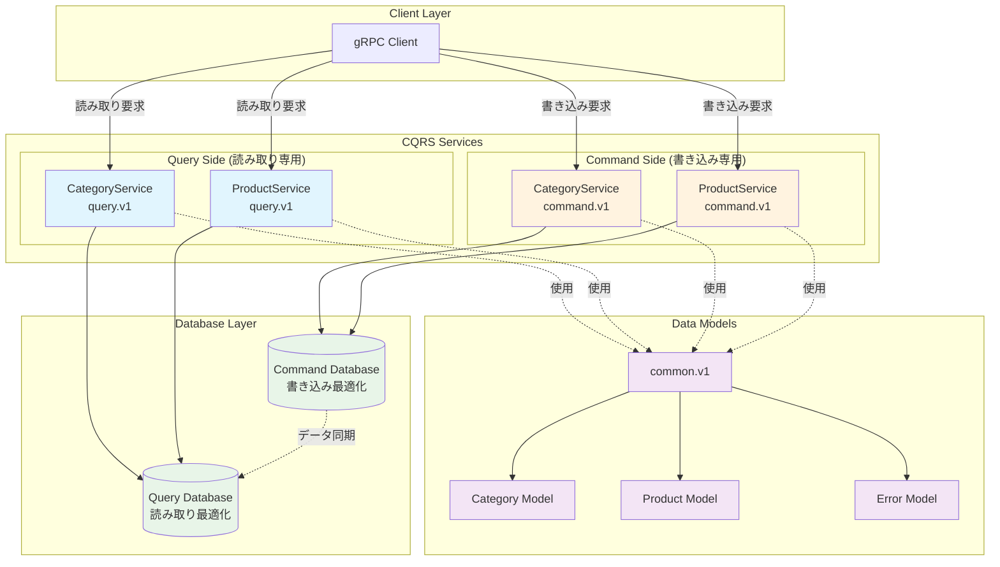

# CQRS gRPC API Documentation

このドキュメントは、CQRS（Command Query Responsibility Segregation）パターンを採用したgRPCマイクロサービスのAPI仕様を定義します。

## 🏗️ アーキテクチャ概要

本プロジェクトは、読み取り（Query）と書き込み（Command）の責務を分離したCQRSパターンを実装しています。



## 📁 プロジェクト構造

```text
api/
├── proto/                    # Protocol Buffers定義
│   ├── command/v1/           # 書き込み操作 (Create, Update, Delete)
│   │   └── command.proto
│   ├── query/v1/             # 読み取り操作 (List, Get, Search)
│   │   └── query.proto
│   └── common/v1/            # 共通データ型
│       ├── models.proto      # カテゴリ・商品モデル
│       └── error.proto       # エラー型
├── gen/                      # 生成されたgRPCコード
├── buf.yaml                  # buf設定ファイル
├── buf.gen.yaml             # コード生成設定
├── Makefile                 # ビルドツール
└── README.md                # このファイル
```

## 🚀 クイックスタート

### 前提条件

- [mise](https://mise.jdx.dev/) がインストールされていること
- [buf](https://buf.build/) CLI tools

### セットアップ

```bash
# 初期セットアップ
make init

# 依存関係の更新とコード生成
make generate

# lintチェック
make lint

# フォーマット
make fmt
```

## 📋 API仕様

詳細なAPI仕様は自動生成されたドキュメントを参照してください：

- **� [API Documentation](./gen/doc/)** - Protocol Buffersから自動生成されたAPIドキュメント

### サービス概要

#### 🔍 Query Service (読み取り専用)

| Service | 説明 | 主要な操作 |
|---------|------|-----------|
| **CategoryService** | 商品カテゴリの読み取り操作 | List, GetById |
| **ProductService** | 商品の読み取り操作 | List, GetById, Search, Stream |

#### ✏️ Command Service (書き込み専用)

| Service | 説明 | 主要な操作 |
|---------|------|-----------|
| **CategoryService** | 商品カテゴリのCRUD操作 | Create, Update, Delete |
| **ProductService** | 商品のCRUD操作 | Create, Update, Delete |

### 📦 Package構成

```text
├── query.v1          # 読み取り専用サービス
├── command.v1        # 書き込み専用サービス
└── common.v1         # 共通データ型（Category, Product, Error）
```

> **Note**: API仕様の詳細は`gen/doc/`ディレクトリ内の自動生成ドキュメントが常に最新です。Protocol Buffersの変更時に自動更新されるため、そちらを参照してください。

## 📊 データモデル

詳細なデータモデル仕様は [自動生成ドキュメント](./gen/doc/common/v1/) を参照してください。

### 主要モデル概要

| Model | 説明 | 主要フィールド |
|-------|------|---------------|
| **Category** | 商品カテゴリ | id, name |
| **Product** | 商品情報 | id, name, price, category |
| **Error** | エラー情報 | code, message, details |
| **CRUD** | 操作種別 | INSERT, UPDATE, DELETE |

> **Note**: バリデーションルールや詳細フィールド定義は、Protocol Buffersファイルおよび生成ドキュメントを参照してください。

## 🔒 バリデーション

本プロジェクトでは[buf/validate](https://github.com/bufbuild/protovalidate)を使用してフィールドレベルのバリデーションを実装しています。

### バリデーション機能

- **文字列**: 最小・最大長、正規表現パターン
- **数値**: 範囲制限、必須チェック
- **タイムスタンプ**: RFC3339形式検証
- **必須フィールド**: 空値チェック

詳細なバリデーションルールは各Protocol Buffersファイルおよび[生成ドキュメント](./gen/doc/)を参照してください。

## 🛠️ 開発ツール

### buf CLI コマンド

```bash
# 依存関係更新
buf dep update

# コード生成
buf generate

# リント実行
buf lint

# フォーマット
buf format -w .

# 破壊的変更チェック
buf breaking --against '.git#branch=main'
```

### Makeコマンド

```bash
make init      # 初期セットアップ
make generate  # gRPCコード生成
make lint      # リントチェック
make fmt       # コードフォーマット
make help      # ヘルプ表示
```

## 🔄 gRPCストリーミング

### Server Streaming

`ProductService.StreamProducts` では、大量の商品データを効率的に配信するためにServer Streamingを使用しています。

詳細な実装例や使用方法は[ProductService API仕様](./gen/doc/query/v1/)を参照してください。

## 🚨 エラーハンドリング

すべてのレスポンスには共通のエラー型が含まれています。詳細なエラー処理パターンは[エラー型仕様](./gen/doc/common/v1/)を参照してください。

### エラーパターン

1. **oneof結果型**: 成功時は結果、失敗時はエラーを返す
2. **エラーフィールド**: 常にエラーフィールドを含む
3. **gRPCステータス**: 標準のgRPCステータスコードも併用

## 📚 参考資料

- [Protocol Buffers Language Guide](https://protobuf.dev/programming-guides/proto3/)
- [gRPC Documentation](https://grpc.io/docs/)
- [buf CLI Documentation](https://buf.build/docs)
- [protovalidate Documentation](https://github.com/bufbuild/protovalidate)
- [CQRS Pattern](https://martinfowler.com/bliki/CQRS.html)

## 🤝 コントリビューション

1. プロトコルバッファの変更前に`buf lint`を実行
2. 破壊的変更は`buf breaking`でチェック
3. 新しいサービスには適切なバリデーションルールを追加
4. ドキュメントの更新も併せて実施
