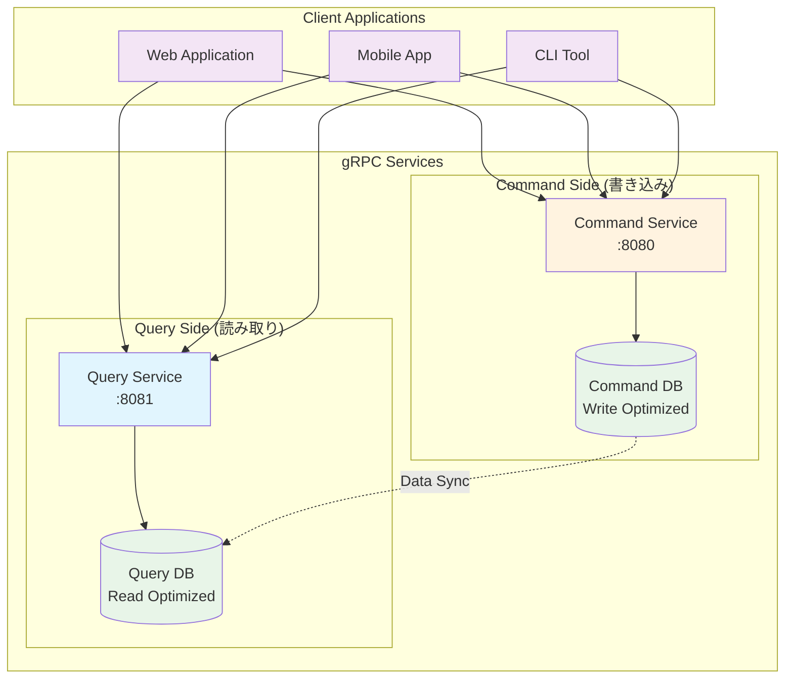

# Practical Go gRPC Micro Service - Workbench

このリポジトリは、Go言語でgRPCマイクロサービスを実装する実践的なプロジェクトです。CQRS（Command Query Responsibility Segregation）パターンを採用し、商品管理システムを題材としたマイクロサービスアーキテクチャを学習できます。

## 🎯 プロジェクト概要

### 目的

- gRPCを使用したマイクロサービスの実装方法を学習
- CQRSパターンによる読み取り・書き込み責務の分離
- Protocol Buffersによるスキーマファーストな開発
- 実用的なAPIバリデーションとエラーハンドリング

### 機能

- **商品管理**: 商品のCRUD操作とカテゴリ管理
- **Command Service**: 書き込み専用サービス（作成、更新、削除）
- **Query Service**: 読み取り専用サービス（一覧、検索、ストリーミング）
- **スキーマバリデーション**: buf/validateによるフィールドレベル検証

## 📁 ディレクトリ構成

```text
workbench/
├── api/                          # API定義・生成コード
│   ├── proto/                    # Protocol Buffers定義
│   └── gen/                      # 自動生成コード
│
├── service/                      # マイクロサービス実装
│   ├── client/                   # クライアント実装例
│   ├── command/                  # コマンドサービス
│   └── query/                    # クエリサービス
│
├── db/                           # データベース関連
│   ├── command/                  # コマンド用データベース
│   ├── query/                    # クエリ用データベース
│   └── logs/                     # データベースログ
│
└── pkg/                          # 共通ライブラリ
```

## 🏗️ アーキテクチャ

このプロジェクトは**CQRS（Command Query Responsibility Segregation）**パターンを採用しています：



### 特徴

- **責務の分離**: 読み取りと書き込みを独立したサービスに分離
- **スケーラビリティ**: 各サービスを独立してスケール可能
- **データベース最適化**: 用途に応じたデータベース設計
- **型安全性**: Protocol Buffersによる厳密な型定義

## 🚀 クイックスタート

### 前提条件

- Go 1.25.1+
- [mise](https://mise.jdx.dev/) (開発環境管理)
- Docker & Docker Compose
- [buf](https://buf.build/) CLI

### セットアップ

```bash
# リポジトリのクローン
git clone https://github.com/haru-256/practical-go-grpc-micro-service.git
cd practical-go-grpc-micro-service/workbench

# 開発環境のセットアップ
mise install

# データベースの起動
cd db
make up

# APIコードの生成
cd ../api
make generate

# 依存関係の解決
cd ..
go mod tidy
```

### サービスの起動

```bash
# コマンドサービス（ポート8080）
go run service/command/main.go

# クエリサービス（ポート8081）
go run service/query/main.go
```

## 🛠️ 開発ワークフロー

### API仕様の変更

1. `api/proto/`でProtocol Buffersファイルを編集
2. `cd api && make generate`でコード生成
3. `go mod tidy`で依存関係更新
4. サービス実装を更新

### データベーススキーマの変更

1. `db/command/ddl/`または`db/query/ddl/`でDDLを編集
2. `cd db && make reset`でデータベースリセット
3. 新しいスキーマでサービスを再起動

## 📚 学習リソース

- **[API仕様書](./api/README.md)** - 詳細なAPI仕様とサンプル
- **[データベース設計](./db/README.md)** - DB設計とCQRS実装
- **公式ドキュメント**:
  - [gRPC Go](https://grpc.io/docs/languages/go/)
  - [Protocol Buffers](https://protobuf.dev/)
  - [buf](https://buf.build/docs/)

## 🤝 コントリビューション

1. Issueで問題を報告または新機能を提案
2. フィーチャーブランチを作成
3. 変更をコミット（コミットメッセージは[Conventional Commits](https://www.conventionalcommits.org/)に従う）
4. プルリクエストを作成

## 📄 ライセンス

このプロジェクトはMITライセンスの下で公開されています。
