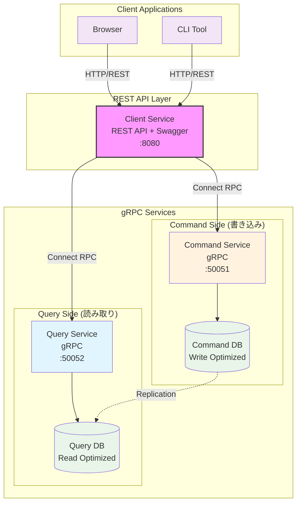

# Practical Go gRPC Micro Service - Workbench

このリポジトリは、Go言語でgRPCマイクロサービスを実装する実践的なプロジェクトです。CQRS（Command Query Responsibility Segregation）パターンを採用し、商品管理システムを題材としたマイクロサービスアーキテクチャを学習できます。

## 🎯 プロジェクト概要

### 目的

- gRPCを使用したマイクロサービスの実装方法を学習
- CQRSパターンによる読み取り・書き込み責務の分離
- Protocol Buffersによるスキーマファーストな開発
- 実用的なAPIバリデーションとエラーハンドリング

### 機能

- **商品管理**: 商品のCRUD操作とカテゴリ管理
- **Command Service**: 書き込み専用サービス（作成、更新、削除）
- **Query Service**: 読み取り専用サービス（一覧取得、詳細取得、キーワード検索）
- **Client Service**: REST APIを提供するフロントエンドサービス（Swagger UI付き）
- **スキーマバリデーション**: protovalidateによるフィールドレベル検証

## 📁 ディレクトリ構成

```text
workbench/
├── api/                          # API定義・生成コード
│   ├── proto/                    # Protocol Buffers定義
│   └── gen/                      # 自動生成コード
│
├── service/                      # マイクロサービス実装
│   ├── client/                   # REST APIクライアント（Swagger UI付き）
│   ├── command/                  # コマンドサービス（書き込み専用）
│   └── query/                    # クエリサービス（読み取り専用）
│
├── db/                           # データベース関連
│   ├── command/                  # コマンド用データベース
│   ├── query/                    # クエリ用データベース
│   └── logs/                     # データベースログ
│
└── pkg/                          # 共通ライブラリ
```

## 🏗️ アーキテクチャ

このプロジェクトは**CQRS（Command Query Responsibility Segregation）**パターンを採用しています：



### 特徴

- **3層アーキテクチャ**: Client Service（REST） → Command/Query Service（gRPC） → Database
- **責務の分離**: 読み取りと書き込みを独立したサービスに分離
- **REST + gRPC**: クライアント向けREST API、サービス間通信はgRPC
- **スケーラビリティ**: 各サービスを独立してスケール可能
- **データベース最適化**: 用途に応じたデータベース設計
- **型安全性**: Protocol Buffersによる厳密な型定義
- **構造化ログ**: slogによるコンテキスト対応の構造化ログ
- **依存性注入**: Uber Fxによる型安全な依存関係管理

## 🚀 クイックスタート

### 前提条件

- Go 1.25.1+
- [mise](https://mise.jdx.dev/) (開発環境管理)
- Docker & Docker Compose
- [buf](https://buf.build/) CLI

### 設定ファイル

各サービスは `config.toml` で設定を管理します：

```toml
[log]
level = "info"     # ログレベル: debug, info, warn, error
format = "text"    # ログフォーマット: text, json

[mysql]
dbname = "command_db"
host = "localhost"
port = 3306
user = "root"
pass = "password"
max_idle_conns = 10
max_open_conns = 100
conn_max_lifetime = "1h"
conn_max_idle_time = "10m"
```

環境変数で設定を上書き可能：

- `LOG_LEVEL`, `LOG_FORMAT`: ログ設定
- `DB_HOST`, `DB_PORT`, `DB_USER`, `DB_PASS`: データベース設定

### セットアップ

```bash
# リポジトリのクローン
git clone https://github.com/haru-256/practical-go-grpc-micro-service.git
cd practical-go-grpc-micro-service/workbench

# 開発環境のセットアップ
mise install

# データベースの起動
cd db
make up

# APIコードの生成
cd ../api
make generate

# 依存関係の解決
cd ..
go mod tidy
```

### サービスの起動

```bash
# コマンドサービス（ポート50051）
cd service/command
go run cmd/server/main.go

# クエリサービス（ポート50052）
cd service/query
go run cmd/server/main.go

# クライアントサービス（ポート8080）- Command/Queryサービスが必要
cd service/client
go run cmd/server/main.go

# Swagger UIでAPIを確認
open http://localhost:8080/swagger/index.html
```

### テストの実行

```bash
# すべてのテストを実行
make test

# Command Serviceのテスト
cd service/command
make test

# Query Serviceのテスト
cd service/query
make test

# Client Serviceのテスト
cd service/client
go test ./...

# 統合テストを含む（データベースが必要）
cd service/command
go test -tags=integration ./...

cd service/query
go test -tags=integration ./...
```

## 🛠️ 開発ワークフロー

### API仕様の変更

1. `api/proto/`でProtocol Buffersファイルを編集
2. `cd api && make generate`でコード生成
3. `go mod tidy`で依存関係更新
4. サービス実装を更新

### データベーススキーマの変更

1. `db/command/ddl/`または`db/query/ddl/`でDDLを編集
2. `cd db && make reset`でデータベースリセット
3. 新しいスキーマでサービスを再起動

## 📚 学習リソース

### サービスドキュメント

- **[Client Service](./service/client/README.md)** - REST APIサービスの実装詳細（Swagger付き）
- **[Command Service](./service/command/README.md)** - 書き込み専用サービスの実装詳細
- **[Query Service](./service/query/README.md)** - 読み取り専用サービスの実装詳細

### その他のドキュメント

- **[API仕様書](./api/README.md)** - 詳細なAPI仕様とサンプル
- **[データベース設計](./db/README.md)** - DB設計とCQRS実装
- **[プロジェクトスタイルガイド](../.gemini/styleguide.md)** - コーディング規約と設計原則

### 公式ドキュメント

- [gRPC Go](https://grpc.io/docs/languages/go/)
- [Protocol Buffers](https://protobuf.dev/)
- [buf](https://buf.build/docs/)
- [Connect RPC](https://connectrpc.com/)
- [Uber Fx](https://uber-go.github.io/fx/)

## 🤝 コントリビューション

1. Issueで問題を報告または新機能を提案
2. フィーチャーブランチを作成
3. 変更をコミット（コミットメッセージは[Conventional Commits](https://www.conventionalcommits.org/)に従う）
4. プルリクエストを作成

## 📄 ライセンス

このプロジェクトはMITライセンスの下で公開されています。
