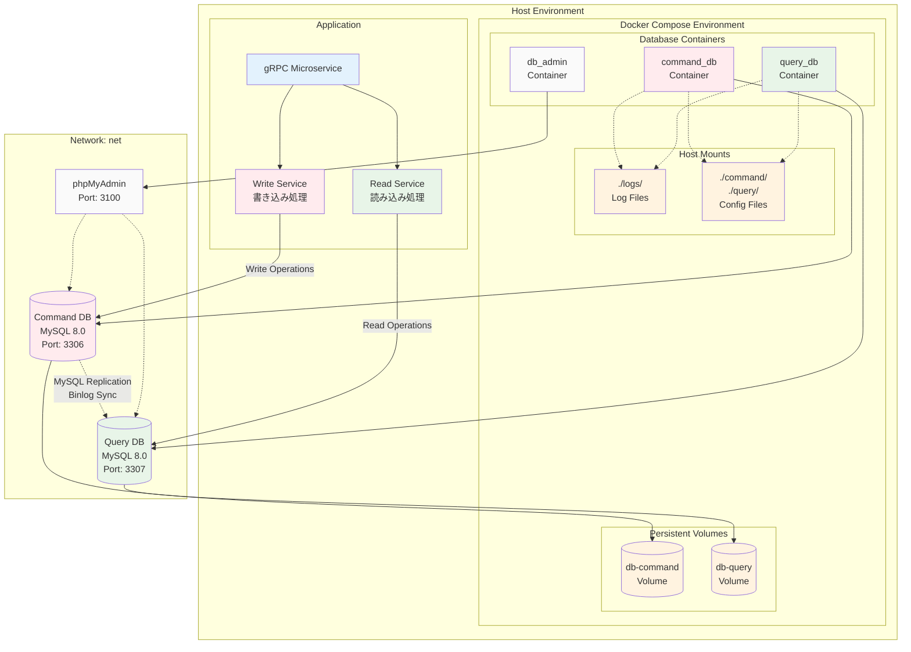
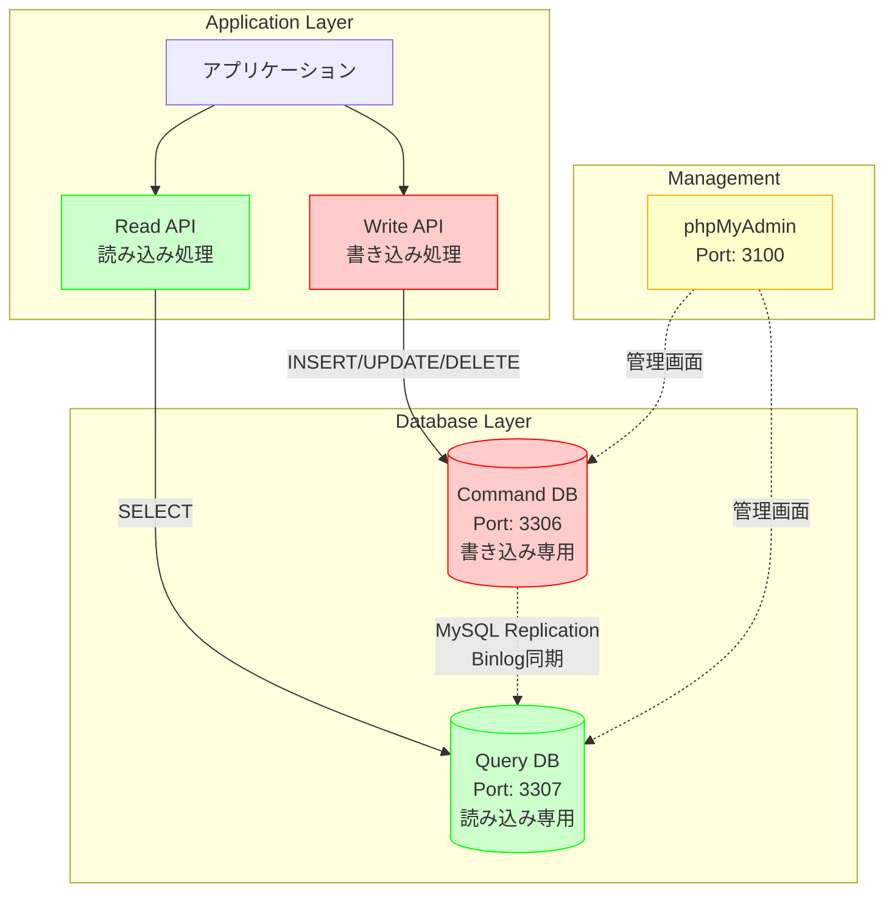
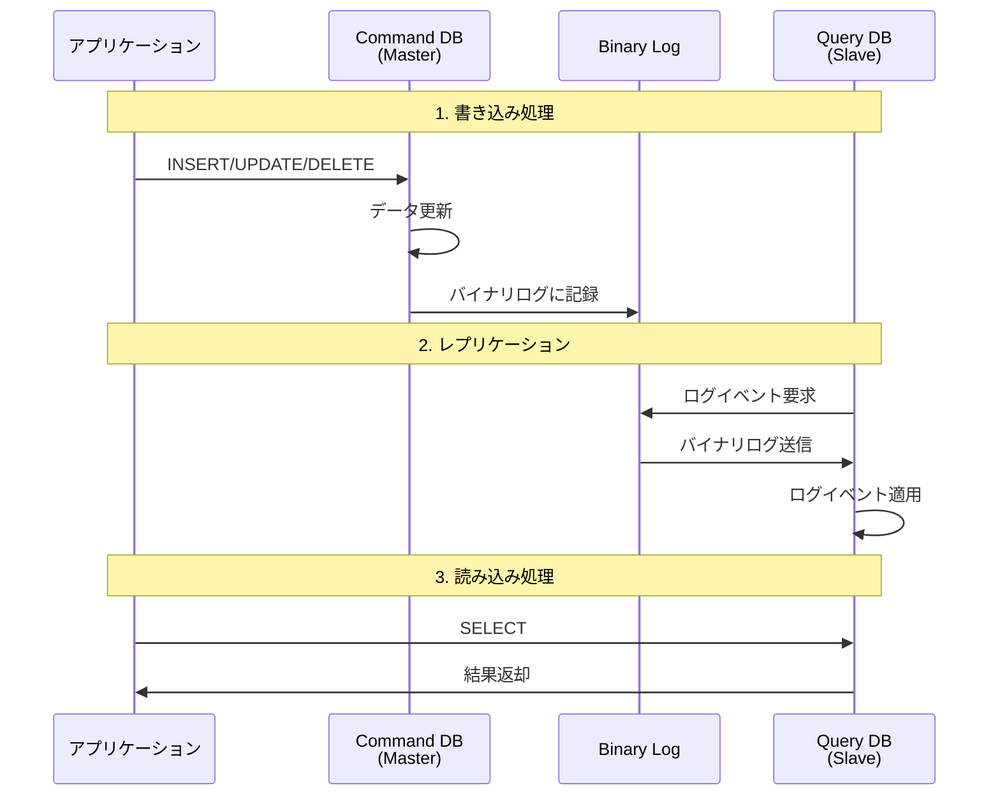
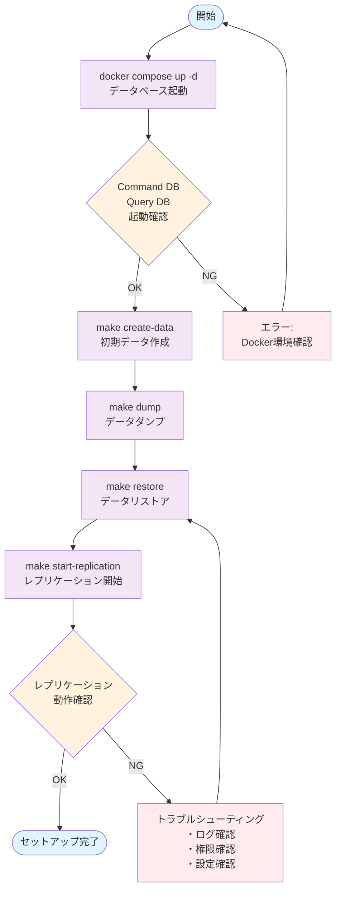
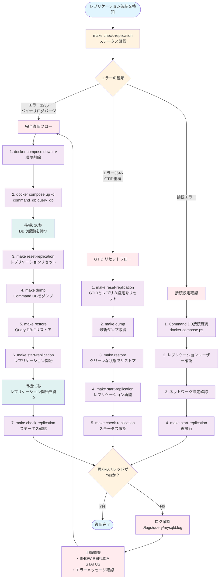

# Database Setup for CQRS Pattern

このディレクトリは、CQRSパターンを実装するためのMySQLレプリケーション環境を提供します。

> **注意**: データベース環境は `workbench/compose.yaml` で管理されています。このディレクトリには設定ファイルとスクリプトのみが含まれます。

## ディレクトリ構成

```text
workbench/db/
├── README.md              # このファイル
├── Makefile              # タスク実行用のMakefile
├── command/              # Command（書き込み）用データベース設定
│   ├── my.cnf           # MySQL設定ファイル
│   ├── ddl/             # DDLファイル
│   │   ├── create_object.sql  # オブジェクト作成SQL
│   │   ├── create_record.sql  # レコード作成SQL
│   │   └── master.db          # ダンプファイル
│   ├── init/            # 初期化SQL（コンテナ起動時に自動実行）
│   ├── scripts/         # 実行スクリプト
│   │   └── dump.sh      # データベースダンプスクリプト
│   └── dump/            # ダンプファイル保存先
├── query/               # Query（読み込み）用データベース設定
│   ├── my.cnf          # MySQL設定ファイル
│   ├── ddl/            # DDLファイル
│   │   ├── master.db   # レストア用ダンプファイル
│   │   └── replication.sql  # レプリケーション設定SQL
│   ├── init/           # 初期化SQL（コンテナ起動時に自動実行）
│   └── dump/           # ダンプファイル保存先
└── logs/               # MySQLログファイル
    ├── command/        # Command DBのログ
    └── query/          # Query DBのログ
```

> **重要**: Docker Compose環境は `workbench/compose.yaml` で定義されています。データベースのみを起動する場合は、以下のコマンドを使用してください：
>
> ```bash
> cd workbench
> docker compose up -d command_db query_db db_admin
> ```

## CQRSレプリケーション構成

### システム全体アーキテクチャ



### アーキテクチャ概要

- **Command DB** (Port: 3306): 書き込み専用のマスターデータベース
- **Query DB** (Port: 3307): 読み込み専用のスレーブデータベース
- **DB Admin** (Port: 3100): phpMyAdmin管理画面

### データフロー

CQRSパターンにおけるデータの流れを以下のMermaid図で示します：



#### データフローの詳細

1. **書き込みフロー（赤色）**
   - アプリケーション → Write API → Command DB
   - INSERT、UPDATE、DELETE操作

2. **読み込みフロー（緑色）**
   - アプリケーション → Read API → Query DB  
   - SELECT操作

3. **レプリケーションフロー（青色）**
   - Command DB → Query DB
   - MySQLバイナリログによる自動同期

4. **管理フロー（黄色）**
   - phpMyAdmin経由での両DB管理

### レプリケーション詳細フロー

MySQLレプリケーションの内部動作を詳しく示します：



## セットアップ手順

> **重要**: すべてのコマンドは `workbench/db/` ディレクトリで実行してください。

### 前提条件

Docker Compose環境が起動している必要があります：

```bash
# workbenchディレクトリから実行
cd workbench
docker compose up -d command_db query_db db_admin

# またはルートのMakefileを使用
make up-db
```

### 1. 初期データ作成

Command DBにテーブルとサンプルデータを作成します。

```bash
# db/ディレクトリで実行
cd db
make create-data
```

### 2. データダンプ

Command DBのデータをダンプファイルに出力します。

```bash
make dump
```

### 3. データリストア

Command DBのダンプをQuery DBにリストアします。

```bash
make restore
```

### 4. レプリケーション開始

Query DBでレプリケーションを開始します。
DumpからGTIDを取得し、`query/ddl/replication.sql`に設定した後、レプリケーションを設定します。

```bash
make start-replication
```

### セットアップフロー図

CQRSレプリケーション環境のセットアップ手順を図解します：



## Makefileコマンド一覧

> **注意**: `make up` と `make down` は削除されました。データベースの起動・停止は `workbench/compose.yaml` で管理してください。

| コマンド | 説明 |
|---------|------|
| `make dump` | Command DBをダンプ |
| `make restore` | Query DBにダンプをリストア |
| `make start-replication` | レプリケーションを開始 |
| `make create-data` | テストデータを作成 |
| `make reset-replication` | レプリケーション設定をリセット |
| `make check-replication` | レプリケーション状態を確認 |
| `make help` | 利用可能なコマンドを表示 |

### データベースの起動・停止

データベースの起動と停止は、workbenchディレクトリのDocker Composeで管理します：

```bash
# データベースのみ起動
cd workbench
docker compose up -d command_db query_db db_admin

# データベースの停止
docker compose stop command_db query_db db_admin

# データベースの削除（ボリュームも削除）
docker compose down -v command_db query_db db_admin
```

## アクセス情報

### データベース接続

- **Command DB**: `localhost:3306`
- **Query DB**: `localhost:3307`
- **ユーザー**: `root`
- **パスワード**: `password`

### 管理画面

- **phpMyAdmin**: <http://localhost:3100>

## 注意事項

1. **Docker Compose統合**: データベース環境は `workbench/compose.yaml` で管理されています
2. **レプリケーション順序**: 必ず上記の手順の順序で実行してください（データベース起動 → 初期データ作成 → ダンプ → リストア → レプリケーション開始）
3. **データ整合性**: Command DBでのデータ変更は自動的にQuery DBに反映されます
4. **ログ確認**: レプリケーション状況は`logs/`ディレクトリで確認できます
5. **初期化**: 環境をリセットする場合は`docker compose down -v`後に`docker compose up -d`から再実行してください

## トラブルシューティング

### レプリケーションが動作しない場合

1. Command DBとQuery DBが正常に起動しているか確認
2. レプリケーションユーザーが正しく作成されているか確認
3. ログファイルでエラーメッセージを確認

### 接続エラーの場合

1. ポートが正しく開放されているか確認
2. Docker Composeのhealthcheckが通っているか確認

## レプリケーション復旧フロー

レプリケーションが破綻した場合の復旧手順を説明します。

### レプリケーション破綻の症状

以下のような症状が見られた場合、レプリケーションが破綻している可能性があります：

- Command DBでデータを作成してもQuery DBに反映されない
- `make check-replication`で`Replica_IO_Running: No`または`Replica_SQL_Running: No`と表示される
- エラー1236: バイナリログがパージされている
- エラー3546: GTID_PURGEDとGTID_EXECUTEDの重複

### 復旧フロー図



### 詳細な復旧手順

#### 1. 完全復旧フロー（推奨）

最も確実な方法です。環境を完全にリセットしてレプリケーションを再構築します。

```bash
# workbenchディレクトリから実行

# 1. 環境を停止して削除
docker compose down -v

# 2. 環境を起動
docker compose up -d command_db query_db

# 3. データベースの起動を待つ（10秒程度）
sleep 10

# db/ディレクトリに移動
cd db

# 4. レプリケーションをリセット
make reset-replication

# 5. Command DBから最新データをダンプ
make dump

# 6. Query DBにリストアしてGTIDを設定
make restore

# 7. レプリケーションを開始
make start-replication

# 8. レプリケーション開始を待つ（2秒程度）
sleep 2

# 9. ステータス確認
make check-replication
```

**確認ポイント:**

- `Replica_IO_Running: Yes`
- `Replica_SQL_Running: Yes`
- `Seconds_Behind_Source: 0`

#### 2. クイック復旧フロー

環境を停止せずに復旧を試みる方法です。

```bash
# 1. レプリケーションをリセット
make reset-replication

# 2. 最新のダンプを取得
make dump

# 3. リストア
make restore

# 4. レプリケーション開始
make start-replication

# 5. 確認
make check-replication
```

#### 3. GTID問題の個別対応

GTID関連のエラーが出た場合の手順です。

```bash
# Query DBでGTIDをリセット
docker compose exec query_db mysql -uroot -ppassword <<EOF
STOP REPLICA;
RESET REPLICA ALL;
RESET MASTER;
EOF

# 最新のダンプを取得してリストア
make dump
make restore
make start-replication
```

### 復旧後の確認事項

#### 1. レプリケーションステータスの確認

```bash
make check-replication
```

以下の値が正常であることを確認：

- `Replica_IO_Running: Yes` - IOスレッドが動作中
- `Replica_SQL_Running: Yes` - SQLスレッドが動作中
- `Seconds_Behind_Source: 0` - 遅延なし
- `Last_IO_Error: (空)` - IOエラーなし
- `Last_SQL_Error: (空)` - SQLエラーなし

#### 2. データ同期の確認

```bash
# Command DBでテストデータを作成
docker compose exec command_db mysql -uroot -ppassword sample_db <<EOF
INSERT INTO categories (category_name) VALUES ('Test復旧確認');
EOF

# 少し待つ（レプリケーション遅延を考慮）
sleep 1

# Query DBで確認
docker compose exec query_db mysql -uroot -ppassword sample_db <<EOF
SELECT * FROM categories WHERE category_name = 'Test復旧確認';
EOF
```

データが表示されれば、レプリケーションは正常に動作しています。

### よくあるエラーと対処法

#### エラー 1236: バイナリログがパージされた

**原因:** Command DBのバイナリログが削除され、Query DBが必要とするトランザクションが失われた

**対処法:** 完全復旧フローを実行

#### エラー 3546: GTID_PURGEDとGTID_EXECUTEDの重複

**原因:** Query DBに既にトランザクション履歴があり、GTIDが重複している

**対処法:**

```bash
make reset-replication  # GTIDをクリア
make dump
make restore
make start-replication
```

#### 接続エラー: Can't connect to source

**原因:** ネットワーク問題またはレプリケーションユーザーの権限不足

**対処法:**

```bash
# レプリケーションユーザーを確認
docker compose exec command_db mysql -uroot -ppassword <<EOF
SELECT user, host FROM mysql.user WHERE user='repl';
SHOW GRANTS FOR 'repl'@'%';
EOF

# 必要に応じてユーザーを再作成
docker compose exec command_db mysql -uroot -ppassword <<EOF
DROP USER IF EXISTS 'repl'@'%';
CREATE USER 'repl'@'%' IDENTIFIED BY 'password';
GRANT REPLICATION SLAVE ON *.* TO 'repl'@'%';
FLUSH PRIVILEGES;
EOF
```

### 予防措置

レプリケーション破綻を予防するための推奨設定：

#### 1. バイナリログ保持期間の延長

`workbench/db/command/my.cnf`に追加：

```ini
[mysqld]
# バイナリログを7日間保持
binlog_expire_logs_seconds = 604800
```

#### 2. 定期的なヘルスチェック

```bash
# cronで定期実行（例: 毎時）
0 * * * * cd /path/to/workbench/db && make check-replication
```

#### 3. 自動復旧スクリプト

重大なエラー検知時に自動復旧を試みるスクリプトを作成することもできます。

### 緊急時の連絡先

レプリケーション破綻時のエスカレーションフロー：

1. まず完全復旧フローを試す
2. 復旧しない場合はログを確認
3. それでも解決しない場合はチームリーダーに相談
