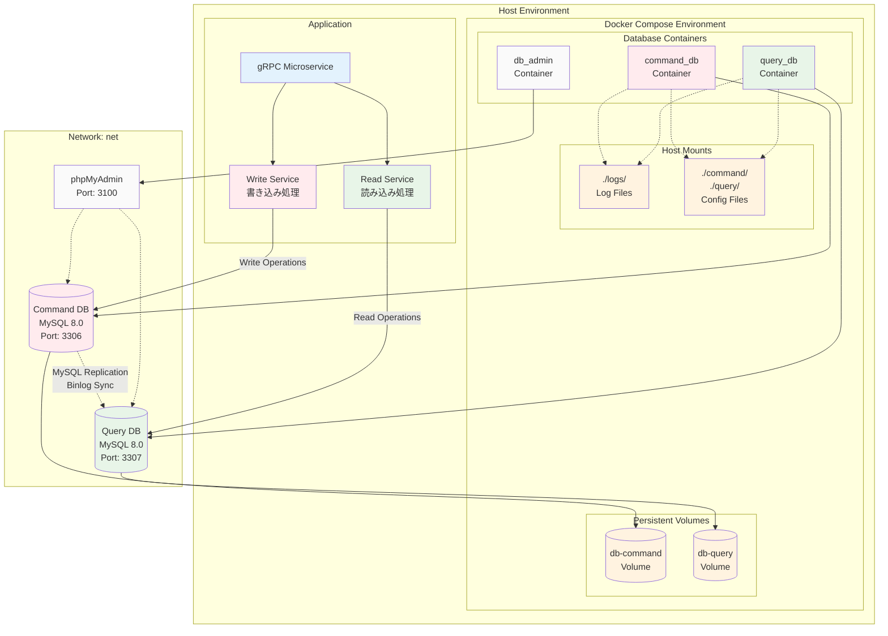
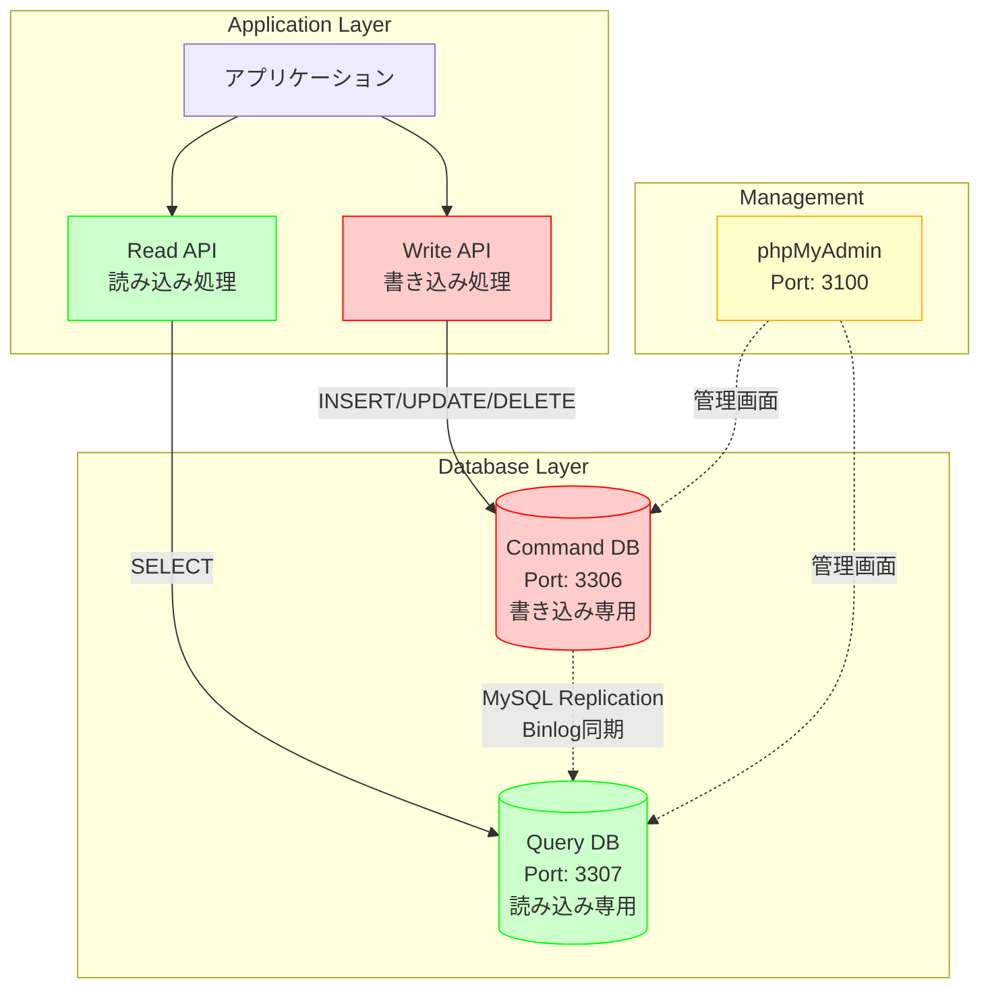
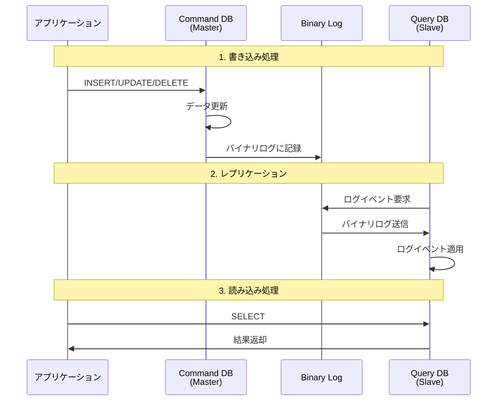
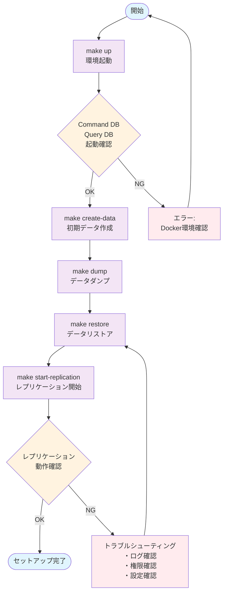

# Database Setup for CQRS Pattern

このディレクトリは、CQRSパターンを実装するためのMySQLレプリケーション環境を提供します。

## ディレクトリ構成

```text
workbench/db/
├── README.md              # このファイル
├── Makefile              # タスク実行用のMakefile
├── compose.yaml          # Docker Compose設定
├── command/              # Command（書き込み）用データベース設定
│   ├── my.cnf           # MySQL設定ファイル
│   ├── ddl/             # DDLファイル
│   │   ├── create_object.sql  # オブジェクト作成SQL
│   │   ├── create_record.sql  # レコード作成SQL
│   │   └── master.db          # ダンプファイル
│   ├── scripts/         # 実行スクリプト
│   │   └── dump.sh      # データベースダンプスクリプト
│   └── sql/             # 初期化SQL
│       └── create_repl_user.sql  # レプリケーションユーザー作成
├── query/               # Query（読み込み）用データベース設定
│   ├── my.cnf          # MySQL設定ファイル
│   ├── ddl/            # DDLファイル
│   │   ├── master.db   # レストア用ダンプファイル
│   │   └── replication.sql  # レプリケーション設定SQL
│   └── sql/            # 初期化SQL
└── logs/               # MySQLログファイル
    ├── command/        # Command DBのログ
    └── query/          # Query DBのログ
```

## CQRSレプリケーション構成

### システム全体アーキテクチャ



### アーキテクチャ概要

- **Command DB** (Port: 3306): 書き込み専用のマスターデータベース
- **Query DB** (Port: 3307): 読み込み専用のスレーブデータベース
- **DB Admin** (Port: 3100): phpMyAdmin管理画面

### データフロー

CQRSパターンにおけるデータの流れを以下のMermaid図で示します：



#### データフローの詳細

1. **書き込みフロー（赤色）**
   - アプリケーション → Write API → Command DB
   - INSERT、UPDATE、DELETE操作

2. **読み込みフロー（緑色）**
   - アプリケーション → Read API → Query DB  
   - SELECT操作

3. **レプリケーションフロー（青色）**
   - Command DB → Query DB
   - MySQLバイナリログによる自動同期

4. **管理フロー（黄色）**
   - phpMyAdmin経由での両DB管理

### レプリケーション詳細フロー

MySQLレプリケーションの内部動作を詳しく示します：



## セットアップ手順

### 1. 環境起動

データベース環境を起動します。

```bash
make up
```

### 2. 初期データ作成

Command DBにテーブルとサンプルデータを作成します。

```bash
make create-data
```

### 3. データダンプ

Command DBのデータをダンプファイルに出力します。

```bash
make dump
```

### 4. データリストア

Command DBのダンプをQuery DBにリストアします。

```bash
make restore
```

### 5. レプリケーション開始

Query DBでレプリケーションを開始します。
DumpからGTIDを取得し、`query/ddl/replication.sql`に設定した後、レプリケーションを設定します。

```bash
make start-replication
```

### セットアップフロー図

CQRSレプリケーション環境のセットアップ手順を図解します：



## Makefileコマンド一覧

| コマンド | 説明 |
|---------|------|
| `make up` | データベース環境を起動 |
| `make down` | データベース環境を停止 |
| `make dump` | Command DBをダンプ |
| `make restore` | Query DBにダンプをリストア |
| `make start-replication` | レプリケーションを開始 |
| `make create-data` | テストデータを作成 |
| `make help` | 利用可能なコマンドを表示 |

## アクセス情報

### データベース接続

- **Command DB**: `localhost:3306`
- **Query DB**: `localhost:3307`
- **ユーザー**: `root`
- **パスワード**: `password`

### 管理画面

- **phpMyAdmin**: <http://localhost:3100>

## 注意事項

1. **レプリケーション順序**: 必ず上記の手順1-5の順序で実行してください
2. **データ整合性**: Command DBでのデータ変更は自動的にQuery DBに反映されます
3. **ログ確認**: レプリケーション状況は`logs/`ディレクトリで確認できます
4. **初期化**: 環境をリセットする場合は`make down`後に`make up`から再実行してください

## トラブルシューティング

### レプリケーションが動作しない場合

1. Command DBとQuery DBが正常に起動しているか確認
2. レプリケーションユーザーが正しく作成されているか確認
3. ログファイルでエラーメッセージを確認

### 接続エラーの場合

1. ポートが正しく開放されているか確認
2. Docker Composeのhealthcheckが通っているか確認
